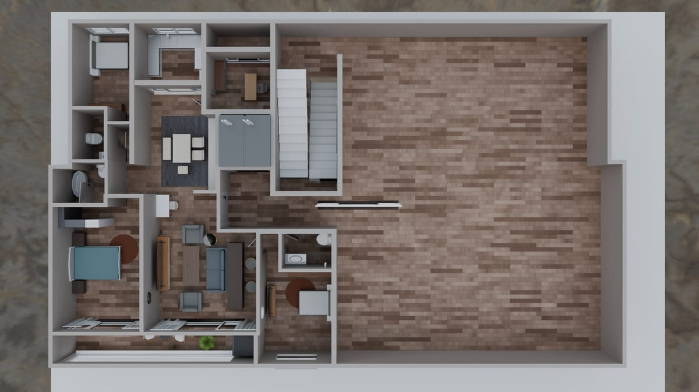
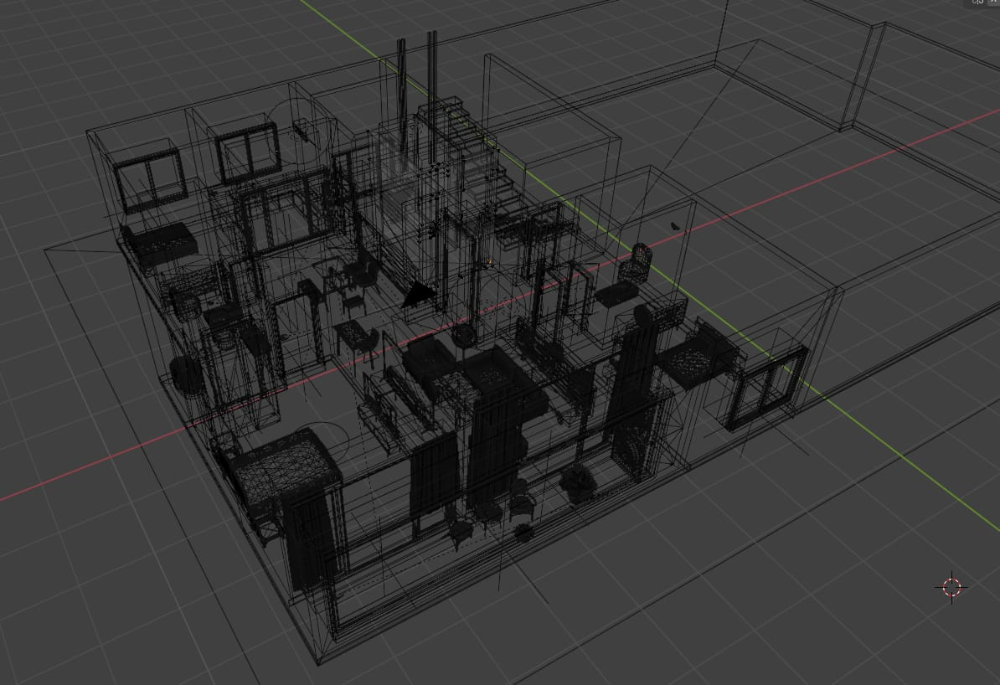
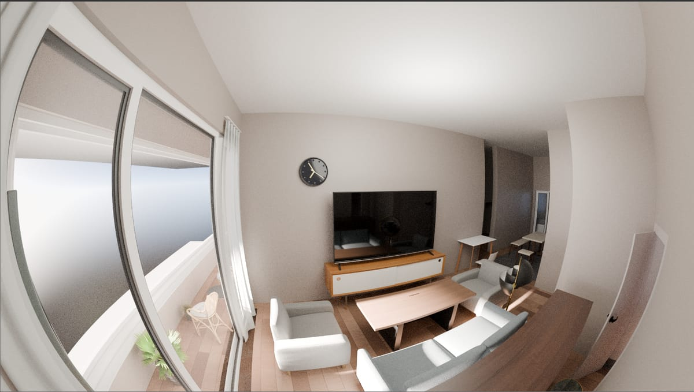
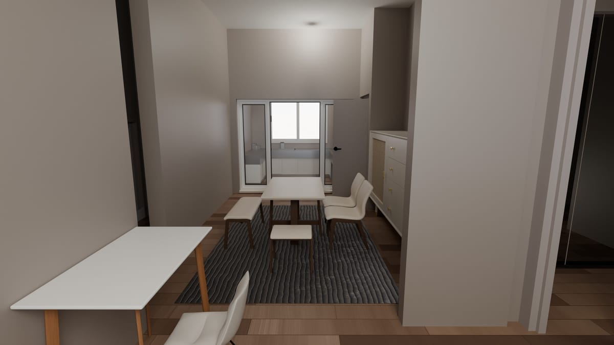
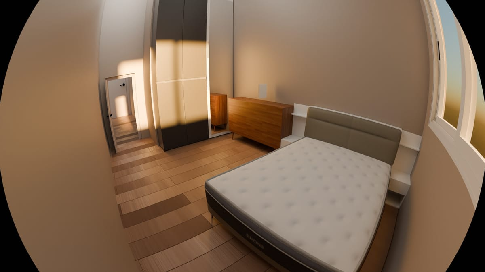
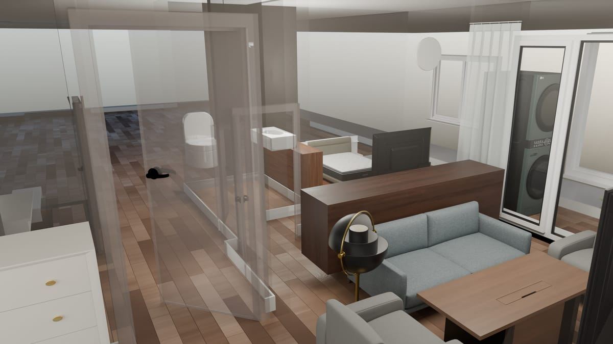
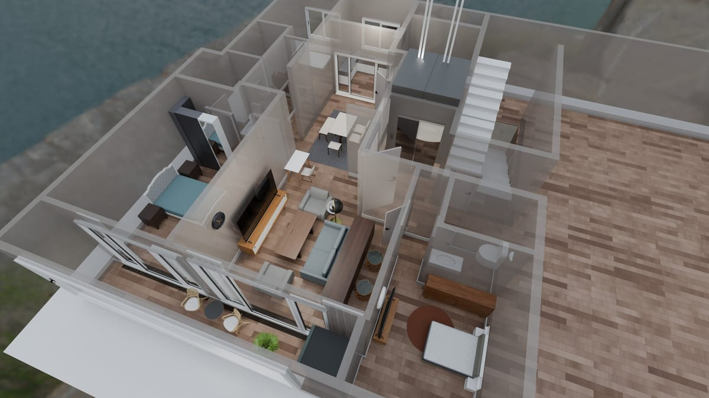
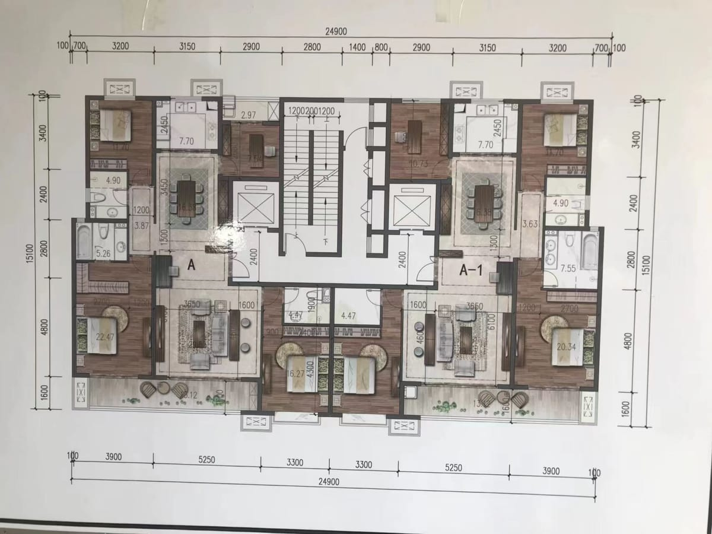

> **分类**：建模渲染 ｜ **类型**：课程设计 ｜ **完成时间**：2024-06
>
> **使用工具**：SketchUp · 渲染器 · AutoCAD

## 说明

人机工程课程设计，完成一套住宅的平面布置与室内空间设计：以人体尺度与动线为依据确定家具尺寸与摆放位置，用 SketchUp 建立空间与家具模型，输出客厅、餐厅、厨房、主卧、卫生间的室内渲染图与鸟瞰轴测图，并整理带尺寸标注的施工图。

## 预览

## 素材

*源文件 8 个 / 5.2 MB（含 PPT 汇报）· 制作于 2024-06*
