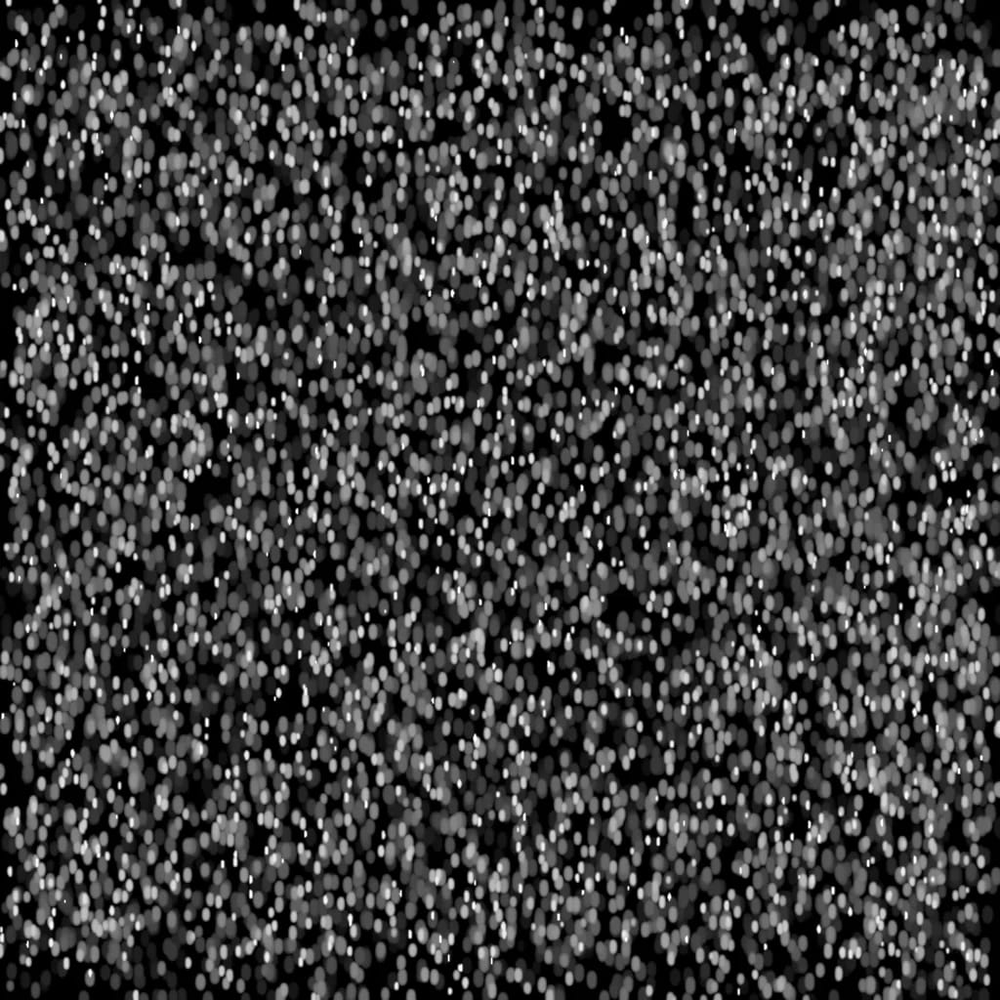

> **分类**：场景动画 ｜ **类型**：练习 ｜ **完成时间**：2024-05-31 ｜ **时长**：约 2.8 秒循环
>
> **使用工具**：三维渲染

## 说明

雨夜街道的场景动画练习：低机位看向湿滑路面，雨滴下落、地面积水反射路灯与远处车灯，整体压在暖黄与冷蓝的对比里。成片约 2.8 秒，做成静音循环。

## 动图

<video src="/clips/scene-0531.mp4" autoplay loop muted playsinline style="width:100%;border-radius:10px;display:block"></video>

## 素材

## 预览

