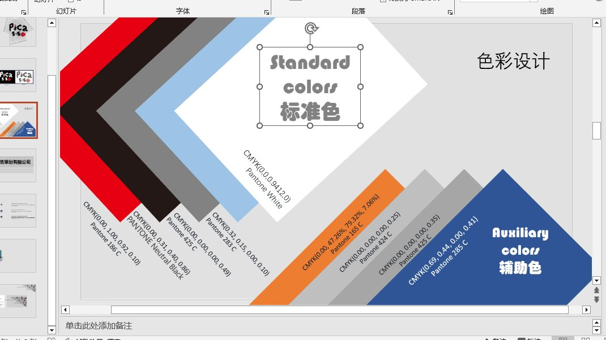
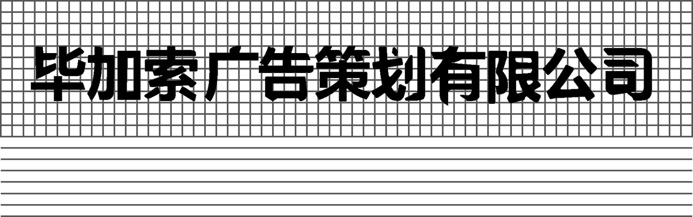
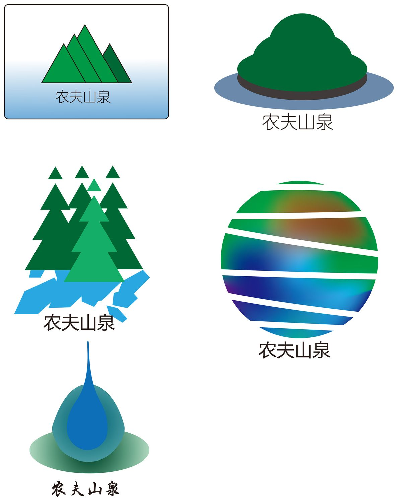

> **分类**：平面设计 ｜ **编号**：01-03 ｜ **完成时间**：2024-11-26
>
> **使用工具**：Illustrator / PowerPoint
>
> **标签**：VI · 品牌 · 标志 · 平面

## 说明

一套 VI（视觉识别）基础系统练习，对象是虚构的「毕加索广告策划有限公司」。手册按基础系统的标准顺序排下来：标准标志 → 标志变形 → 标准色与辅助色 → 字体 → 组合模式 → 商标品牌 → 象征纹样，源文件是 Illustrator 的 .ai。

## 手册里有什么

| 部分 | 内容 |
| --- | --- |
| 标准标志 | 企业主标志 |
| 标志变形 | 反白设计、扭曲设计、空心设计三种 |
| 标准色与辅助色 | 9 组配色，每组都给出 CMYK 与 Pantone 对应值 |
| 标准字体 | 给了 12mm–120mm、15mm–150 两档规格 |
| 印刷字体 | 中文用方正姚体；西文用 Artifakt Element，含 A–Z、a–z 与数字符号 |
| 组合模式 | 标志与文字的横向 / 纵向组合规范 |
| 商标品牌 | 拆成两个部门标志：平面设计部门、实物产品设计部门 |
| 象征纹样 | 品牌辅助图形 |

色彩规范里出现的 Pantone 号包括 White、186 C、Neutral Black、283 C、285 C、424 C、425 C、165 C——从红到深蓝、从中性黑灰到暖橙，覆盖了主色与辅助色的梯度。

> 这份练习只做了视觉规范本身，文档里没有留下设计推导与说明。

## 预览

## 素材

| 项目 | 数量 |
| --- | --- |
| 源文件 | 22 个 / 14.4 MB |
| 构成 | 图片 20 个 · 文档 1 个 · 其它 1 个 |
