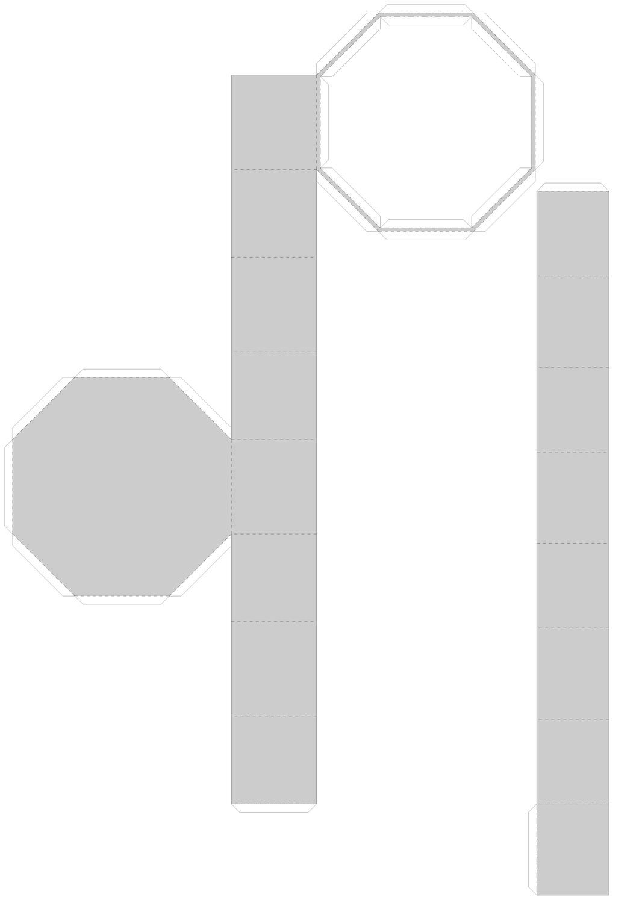
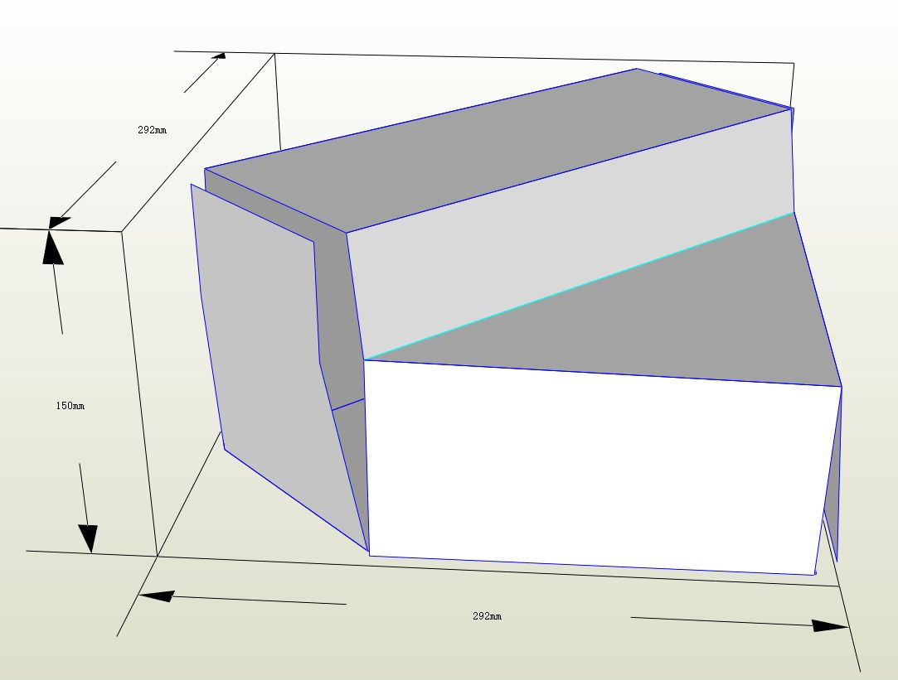
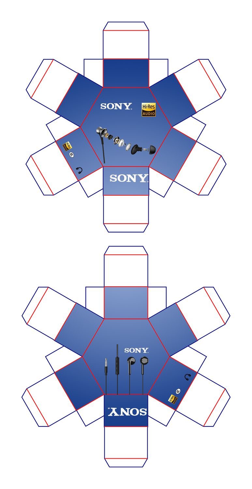

> **分类**：平面设计 ｜ **编号**：01-04 ｜ **完成时间**：2024-12-29
>
> **使用工具**：Photoshop / Illustrator
>
> **标签**：包装 · 结构 · 刀模 · 平面

## 说明

一组以「ear / PURE SOUND」真无线耳机为主题的包装结构设计。包含手提袋、锥形方盒、正六边形对盖盒、扣边翻盖盒、飞机式插锁盒等多款盒型的展开图与成品渲染，以及实物打样照片。同时还收录了 SONY 耳机包装的刀模展开与效果图，可对比不同品牌的结构语言。

## 预览

## 素材

| 项目 | 数量 |
| --- | --- |
| 文件 | 115 个 / 499.0 MB |
| 图片 | 116 张 |
| 视频 | 0 段 |

制作时间跨度：2024-12-08 ～ 2024-12-29
