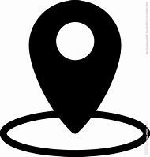

> **分类**：平面设计 ｜ **编号**：01-05 ｜ **完成时间**：2023-11-07
>
> **使用工具**：Photoshop / Illustrator
>
> **标签**：名片 · 排版 · 平面

## 说明

名片排版练习，包含正反面设计与印刷参考图。

## 预览

## 素材

| 项目 | 数量 |
| --- | --- |
| 文件 | 7 个 / 3.7 MB |
| 图片 | 7 张 |
| 视频 | 0 段 |

制作时间跨度：2023-11-03 ～ 2023-11-07
