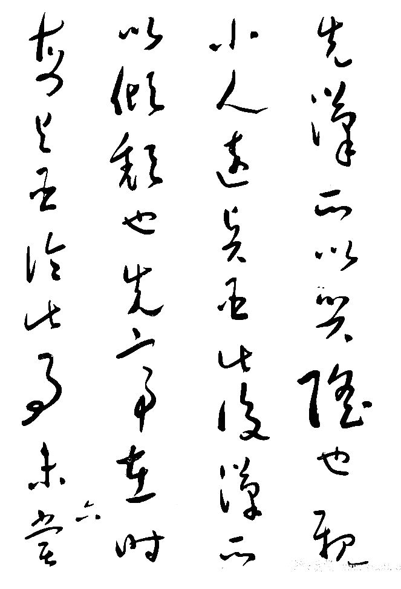
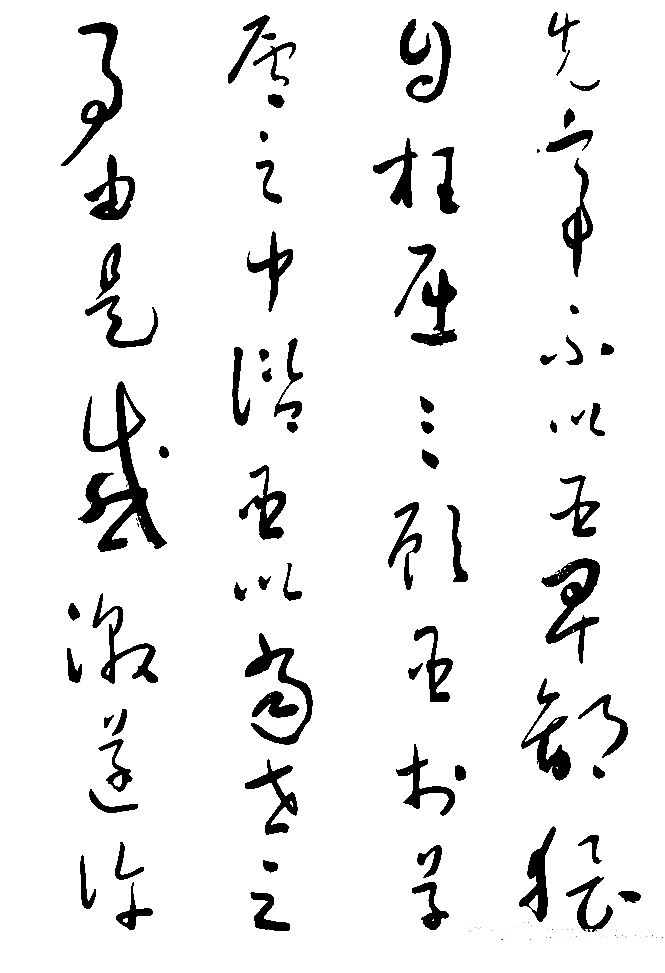
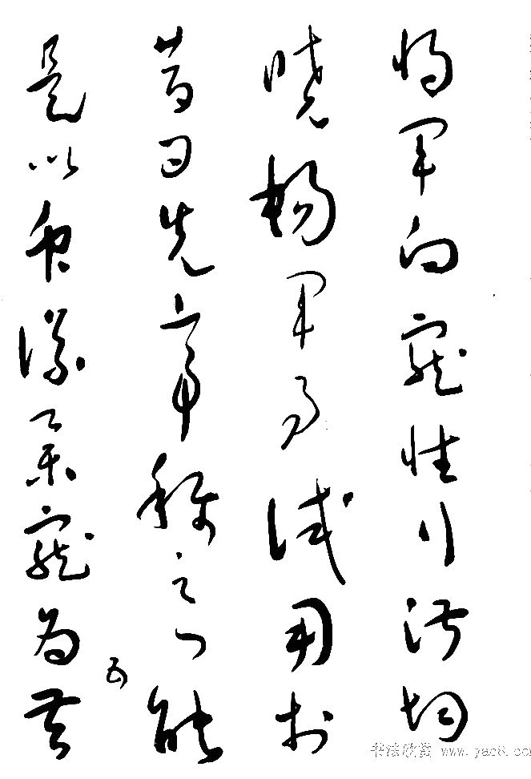

> **分类**：平面设计 ｜ **编号**：01-06 ｜ **完成时间**：2025-09-07
>
> **使用工具**：Photoshop / Blender
>
> **标签**：书法 · 传统 · 卡牌 · 平面

## 说明

桌面「玩玩」文件夹里的一批个人练习：一是 20 余张毛笔字书写稿（PSD + PNG），可作为版式与字体设计的素材库；二是「忠 / 反」两张卡牌式的传统纹样设计（含 PSD 分层文件）。另外还包含一件游戏道具（Vector 45 ACP）的 Blender 渲染，属于三维练习，已一并归档。

## 预览

## 素材

| 项目 | 数量 |
| --- | --- |
| 文件 | 52 个 / 27.4 MB |
| 图片 | 57 张 |
| 视频 | 0 段 |

制作时间跨度：2025-05-17 ～ 2025-09-07
