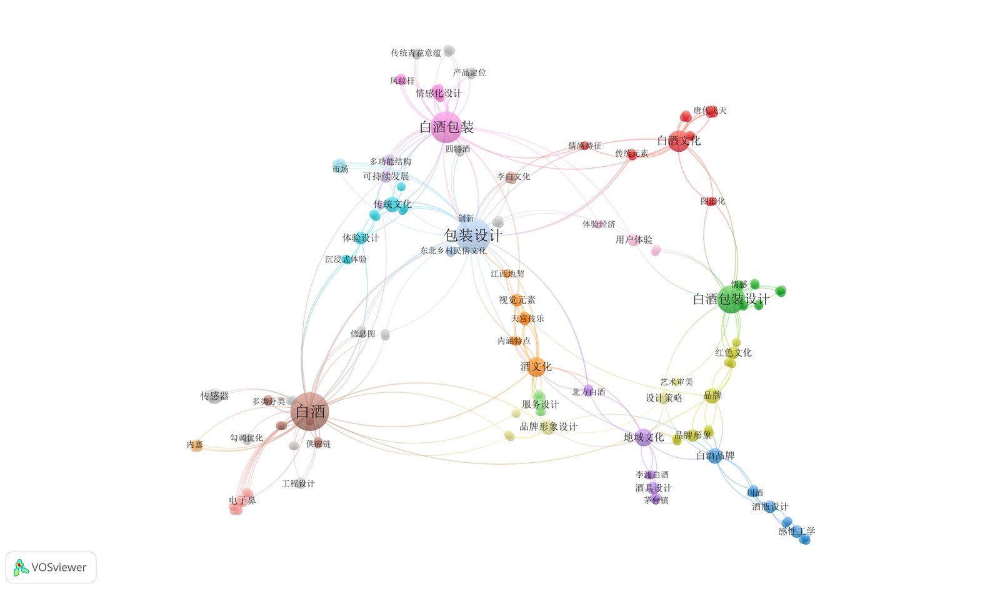
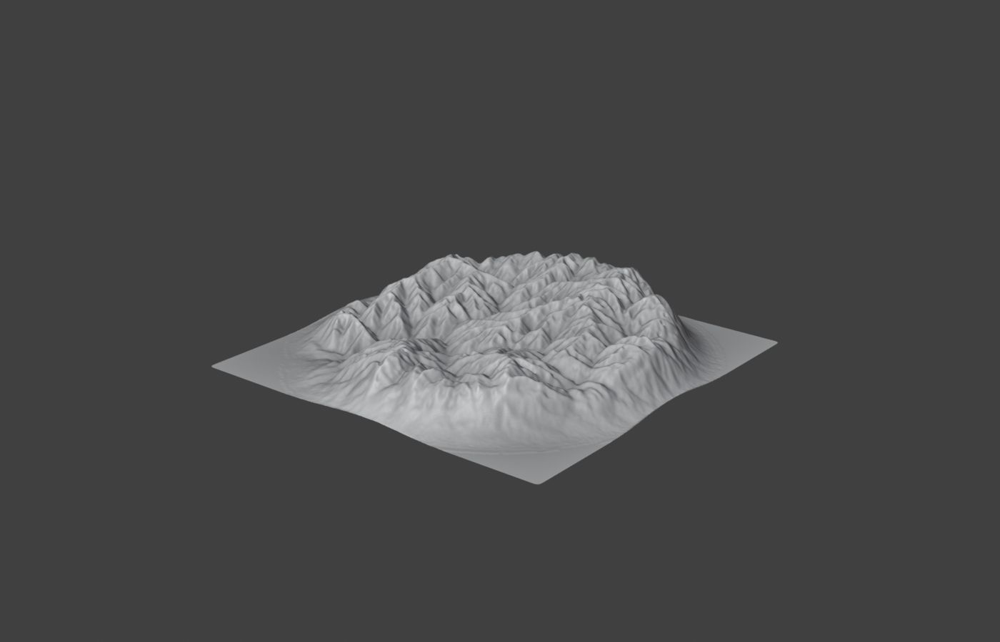
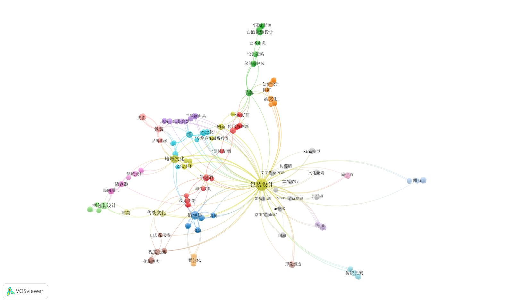

> **分类**：平面 ｜ **编号**：01-09 ｜ **完成时间**：2026-02-10
>
> **使用工具**：Photoshop / Illustrator / Rhino / KeyShot / Blender / Word
>
> **标签**：毕业设计 · 论文 · 包装 · 白酒 · 地域文化

## 说明

2026 届本科毕业设计，题目《基于宝鸡地域文化的白酒包装设计》。选题 2025 年 11 月 20 日下达，结题 2026 年 5 月 11 日，论文定稿在 5 月下旬。

论文摘要里把做这个题目的理由写得很直接：**市面上的白酒包装同质化严重，文化表达大多停留在表面元素的堆叠**。所以这个课题要解决的不是「再画一个好看的瓶子」，而是找一条把地方文化真正翻译成包装语言的方法。

## 题目怎么定下来的

落题时收窄到了**地域**这一条线——宝鸡的周秦与青铜器文脉，加上太白山的自然景观。第一章还先用 VOSviewer 把近十年的相关文献做了关键词可视化，确认这个方向有人做、但没做透。

市场侧的判断来自中国酒业协会《2025 中国白酒市场中期研究报告》和一轮产品调研：主流价格带已经从 **300–500 元下移到 100–300 元**，消费场景转向**婚宴、家宴**。另外深析了 5 个地域文创案例（中华年画酒、越王楼、邳州印象、仰韶彩陶坊·天时 20、茅台 1935），结论是两条路都走不通——要么是文化符号的简单复制，要么陷进工艺材质的奢华堆叠，**核心消费场景与功能设计反而模糊**。

## 调研：100 份产品样本、59 份问卷、30 件文物

论文的调研分三条腿站着，都是能落地的数字：

- **产品调研**：线下加线上收集了 **100 份白酒产品样本**，整理成对照表格。主流容器材质高度集中在**玻璃与陶瓷**；工艺上出现频率最高的是**云纹、龙纹、谷穗**三类传统纹样，配合**浮雕与烫金**。
- **用户调研**：问卷星线上问卷，调研时间 **2026 年 1 月 1 日到 1 月 4 日**（四天），**回收 59 份**。购买需求集中在节日与商务场景；风格偏好排序是**现代简约 > 文创 > 传统**；价格上多数人选 **150–500 元**区间——这条直接推出「贴合大众消费、不要过度包装」的定位。
- **实地调研**：多次去**宝鸡青铜器博物馆**，从馆藏里选了 **30 件青铜器、玉器等展品**作为样本；回来用 Photoshop 预处理文物图像，提取、简化，一步步搭出可用的**纹样素材库**。

## 两条文化线，两套配色

**青铜器线**（器物与纹样）——配色不是凭感觉调的：主色调是**铜锈绿 `#3B7A6B`** 与**墨青绿 `#28544B`**，点缀色是**古铜金 `#BF8F6A`** 与**鎏金色 `#C9A87C`**；背景基底色用了绣红褐、深褐土 `#4E4039`、青铜灰 `#6A8480` 与浅陶色 `#DACCB8`。整套色卡从文物本身的锈色与陶色里提的。

**太白山线**（自然景观）——这条线做得更「硬」：从**国家地理信息公共服务平台的卫星高度数据**建了太白山的数字地形模型，山的起伏是数据长出来的，不是画出来的。色卡主调取天空与湖泊的蓝，点缀色取花海里的牡丹、杜鹃与枫叶，底色用花岗岩的灰与山顶积雪的白。历史依据上还翻到了西安碑林博物馆藏的**贾鉝《太白全图》（康熙三十九年，1700 年）**。

两条线最后合成一套视觉系统：纹样、轮廓、配色加辅助图形。**Logo 取太白山主峰轮廓，用三角形层叠构成山势起伏**——论文里那句是「静默中有文脉流转」。

## 结构：把包装做成一本书

这是整个方案里我最满意的地方，也是论文里写得最细的一段。

- **容器**：500 / 450 / 350 ML 三种规格，**扁形玻璃瓶**。玻璃是白酒容器的经典材料——成本可控、结构强度够、加工工艺成熟，形状和大小的自定义空间也大。
- **外包装**：模仿**书本的翻折结构**，整体由**封面、封底、书背**三部分构成，外观尺寸参考**书籍开本的比例关系**。封面分 A / B 面：A 面是青铜器文化的简介，B 面用风格化的配图处理，两面形成对比。
- **夹页**：中间插一张附页，既固定酒瓶，又给包装加上特种纸张的厚重纹理；附页上嵌**青铜铭文**——既有金属质感的联想，又把地域文化的底子压在里面。
- **收纳之后**：产品取出后，包装能**立起来当书籍摆件**，靠书背继续展示文化主题。包装从「一次性外衣」变成了留在桌面上的东西，这也是论文里点明的创新点。
- **工艺**：外包装、内包装与瓶身都用**烫金**，配合**凸版**与浮雕线条做质感；平面包装上还用到激光雕刻、水转印、热转印。
- **品名与文案**：产品名「**一口宝鸡**」，腰贴八个字「**周风秦韵，满盏陈仓**」；配套酒标、腰标、手提袋等辅助包装，与辅助图形互补设计。

## 过程：一路推到方案十五

草图阶段一共出了 **15 种方案**，最终定稿的是**方案十五**——方形瓶身 + 书页结构 + 夹页。前面十几版都是在试错：哪些符号该留、哪些一加就俗。

定稿后的收尾：确定尺寸图、做三维效果图（Blender + KeyShot）与产品动画，制作**两款不同大小的设计展板**（把文化调研、用户调研、元素提取、色彩方案、效果图、实物图与动画演示串成一条线），以及实物模型与打样。

论文本身五章——绪论、设计调研与分析、设计定位、设计实践与方案展示、结语，正文约 1.7 万字，参考文献 42 条。

## 论文自己承认的两个不足

结语里写得很诚实，我原样留着：

1. **文化元素覆盖窄**：只做了青铜器与太白山两条线，「还有非常多的民俗文化、饮食文化等内容因为篇幅没有纳入研究范围」。
2. **工艺只到软件层面**：烫金、凸版这些效果「前期主要通过软件来感受」，**实际生产中的材料观感与成本控制还要进一步验证**。

往后要补的方向也写明了：把民俗与饮食文化纳进来，让地域文化白酒包装设计更完整。

## 预览

## 素材

| 项目 | 数量 |
| --- | --- |
| 源文件 | 54 个 / 385.3 MB |
| 构成 | 图片 4 个 · 三维工程 2 个 · 文档 47 个 · 其它 1 个 |

制作时间跨度：2025-12-21 ～ 2026-02-10

## 过程与复盘

从开题到定稿，先做完三条调研，把结论收敛成「简而有韵」的定位，再进入瓶型、结构与视觉系统的推演，最后补结构图、展板与实物模型。前期研究文档——开题报告、任务书、摘要、绪论、市场 / 产品 / 用户 / 设计元素调研、研究方法与技术、问卷、中期检查表、答辩 PPT——都留在作品文件夹里。

<!-- 待补：等作者口述「怎么起手、改了几版、卡在哪、最后怎么定稿」后补上 -->
