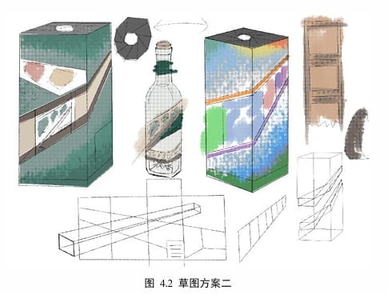
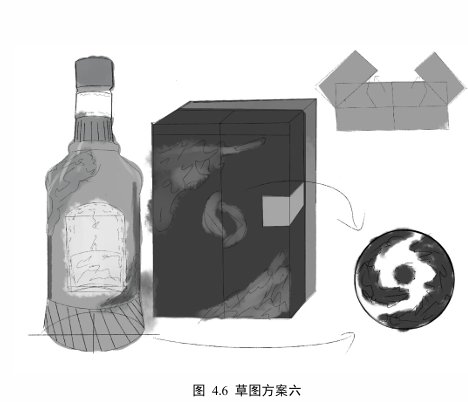

> **分类**：平面设计 ｜ **编号**：01-09 ｜ **完成时间**：2026-02-10
>
> **使用工具**：Photoshop / Illustrator / Blender / Word
>
> **标签**：毕业设计 · 包装 · 白酒 · 文化 · 平面

## 说明

本科毕业设计课题，也是我目前研究链条最完整的一个项目。题目落在「宝鸡地域文化 × 宝鸡文理学院校园文化」的交点上：宝鸡是周秦文明发祥地与青铜器之乡——何尊铭文里的「中国」二字、石鼓文的书艺、太白山的生态；而宝鸡文理学院承续的正是这一脉地方文脉。

这两件事此前基本是分开的：市面上的地域文创白酒大多停在青铜器造型仿制或图腾堆砌，学院文化要素几近阙如。所以这个课题想做的是把两者接起来，策略概括成一句话——**在地符号学院化，学院叙事在地化**，最后落成一套概念白酒包装方案。

## 为什么做这个题目

- 白酒是饱含民族记忆与集体情感的文化消费品：从祭祀、唐宋诗人的精神媒介，到婚丧嫁娶与佳节团聚，它的价值核心在于能否引发**文化认同**
- 但当前白酒包装普遍存在「设计单调、设计专注于表面、设计同质化」的问题，地域文创白酒尤其面临创新不足与文化表达浅表化
- 理论上，这是「地域历史遗产 + 高校当代文化」的一个具体案例；实践上，是给酒类产品找一条靠文化辨识度和故事性建立差异的路

## 调研怎么做的

方法上用了市场调研法（线下实体店铺与商超考察，加上淘宝、抖音、天猫的线上交流）、问卷调查法、文献查阅法与案例分析法，配合电脑软件技术与包装加工技术。流程按开题报告的框架推进：

1. 绪论：确认研究意义与目的
2. 国内外文创白酒研究现状
3. 白酒市场调研 + 产品调研（行业报告、产品对比表、线下照片）
4. 用户调研：用问卷绘制用户画像
5. 文创竞品包装对比
6. 设计元素调研：到宝鸡文理学院与宝鸡青铜器博物馆实地调研，采集纹样、色卡与字体

其中几条结论直接影响了后面的设计：

- 《2025 中国白酒市场中期研究报告》显示，产业进入「政策调整期、消费结构转型期、存量竞争深度调整期」三期叠加，市场呈现量减价增、消费理性、分化加剧
- 主流价格带从 300–500 元**下沉到 100–300 元**，饮用场景从高端商务宴请转向婚宴、家宴与自饮
- 宝鸡青铜器博物院馆藏珍贵文物逾 54 万件/套，可用的视觉母题相当充足
- 痛点写得很直白：多数地域文创白酒「高度依赖消费者对特定地域文化的认知，非本土或非文化爱好者难以产生价值认同」——做竞品对比表时，这一栏在五款竞品上填的内容几乎完全相同

对比的竞品包括中华年画酒、越王楼酒、邳州印象、仰韶彩陶坊·天时 20、茅台 1935·宫候以酒。

## 设计元素怎么取

把宝鸡文化拆成三层来取用：

| 层次 | 内容 |
| --- | --- |
| 精神理念层 | 周礼的「崇德向善、礼乐秩序」 |
| 物质遗存层 | 何尊、逨盘、镶嵌狩猎纹铜壶；饕餮纹、夔龙纹、蟠螭纹；周原与秦雍城遗址 |
| 非遗民俗层 | 陇县与陈仓社火脸谱、凤翔泥塑、木版年画、西秦刺绣、炎帝祭典 |

落到包装上：

- **瓶型**：融合何尊器型的庄重与书卷的舒展
- **图案**：取石鼓文的笔画结构、校园建筑轮廓与秦岭生态图式，做层叠构图
- **色彩**：青铜青褐 + 校园主色 + 黄土金秋
- **材料**：陶质与再生纸
- **结构**：设计可展开的「文理笺」交互结构，把学脉历程与地域知识嵌进去

## 成果

一套系列化包装设计方案，含文化阐释图、设计草图、效果图、结构图与实物模型；另有研究报告、设计实验记录与文化分析资料。前期研究文档——开题报告、任务书、摘要、绪论、市场 / 产品 / 用户 / 设计元素调研、研究方法与技术、问卷、中期检查表、答辩 PPT——以及 9 篇白酒包装方向的参考文献，都留在作品文件夹里。

## 预览

## 素材

| 项目 | 数量 |
| --- | --- |
| 源文件 | 54 个 / 385.3 MB |
| 构成 | 图片 4 个 · 三维工程 2 个 · 文档 47 个 · 其它 1 个 |

制作时间跨度：2025-12-21 ～ 2026-02-10

## 过程与复盘

从开题到定稿跨了 2025-12-21 到 2026-02-10 这段时间：先做完六步调研，把结论收敛成「文化认同型文创白酒」的定位，再进入瓶型与图案的推演，最后补结构图与实物模型。

<!-- 待补：等作者口述「怎么起手、改了几版、卡在哪、最后怎么定稿」后补上 -->
