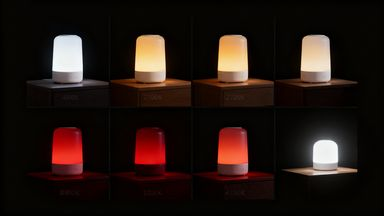

> **分类**：平面设计 ｜ **编号**：01-10 ｜ **完成时间**：2025-11-05
>
> **使用工具**：PowerPoint / Word
>
> **标签**：设计管理 · 提案 · 平面

## 说明

《设计管理》结课作业：一款基于人体昼夜节律的智能助眠唤醒灯设计提案。用设计管理思维系统分析了设计思路与整体构想、设计可行性、核心技术问题、样品与规模化生产、经济及社会效益五个部分，并给出助眠（日落模拟）与唤醒（日出模拟）的完整工作逻辑。含 PPT 与封面文档。

## 预览

## 素材

| 项目 | 数量 |
| --- | --- |
| 文件 | 9 个 / 9.8 MB |
| 图片 | 5 张 |
| 视频 | 0 段 |

制作时间跨度：2025-11-03 ～ 2025-11-05
