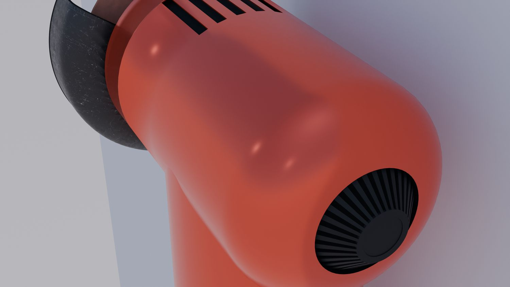
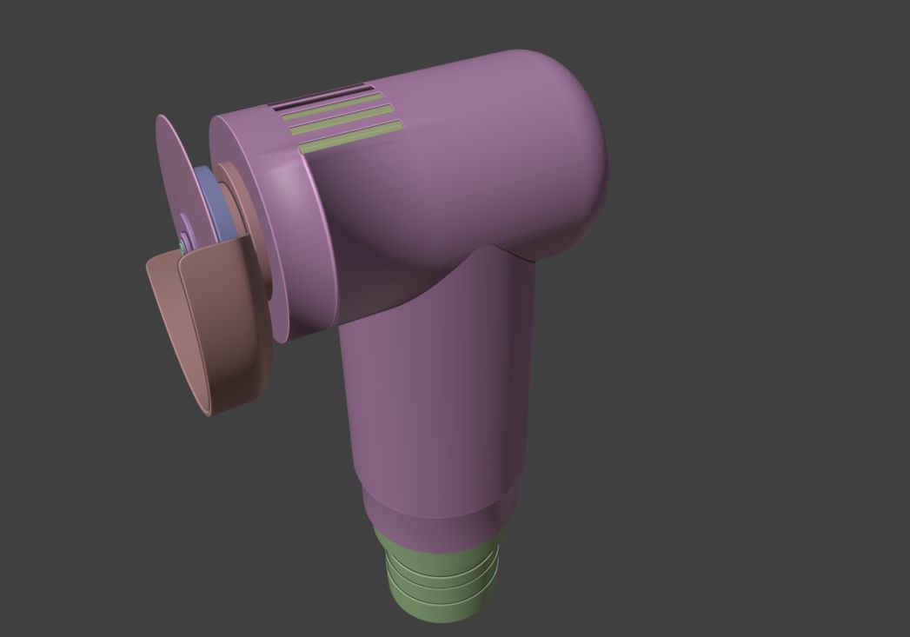

> **分类**：三维建模 ｜ **编号**：02-11 ｜ **完成时间**：2024-06-29
>
> **使用工具**：Blender / Rhino / Photoshop
>
> **标签**：产品设计 · 电动工具 · 建模 · 草图

## 说明

电动工具（角磨机、手电钻、电动螺丝刀）的完整设计流程作业。包含手绘方案草图（多张马克笔效果图）、Blender 建模渲染（黑橙配色的电钻系列）、结构线框与内部结构图，以及最终的「角磨机设计」展板。文件夹里有渲染 PNG、JPEG 预览、展板与源文件。

## 预览

## 素材

| 项目 | 数量 |
| --- | --- |
| 文件 | 78 个 / 497.8 MB |
| 图片 | 68 张 |
| 视频 | 0 段 |

制作时间跨度：2024-06-09 ～ 2024-06-29
