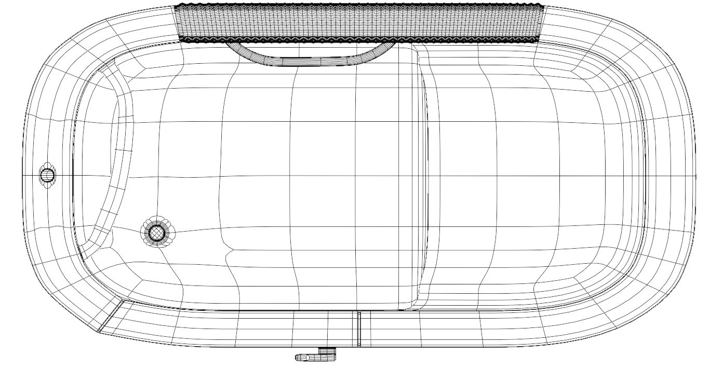
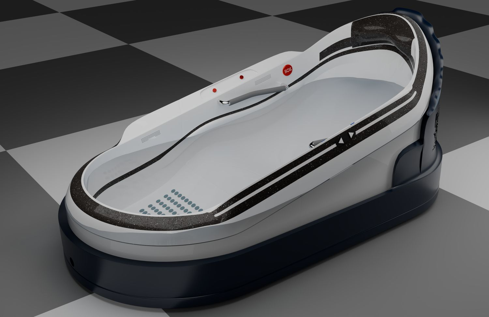
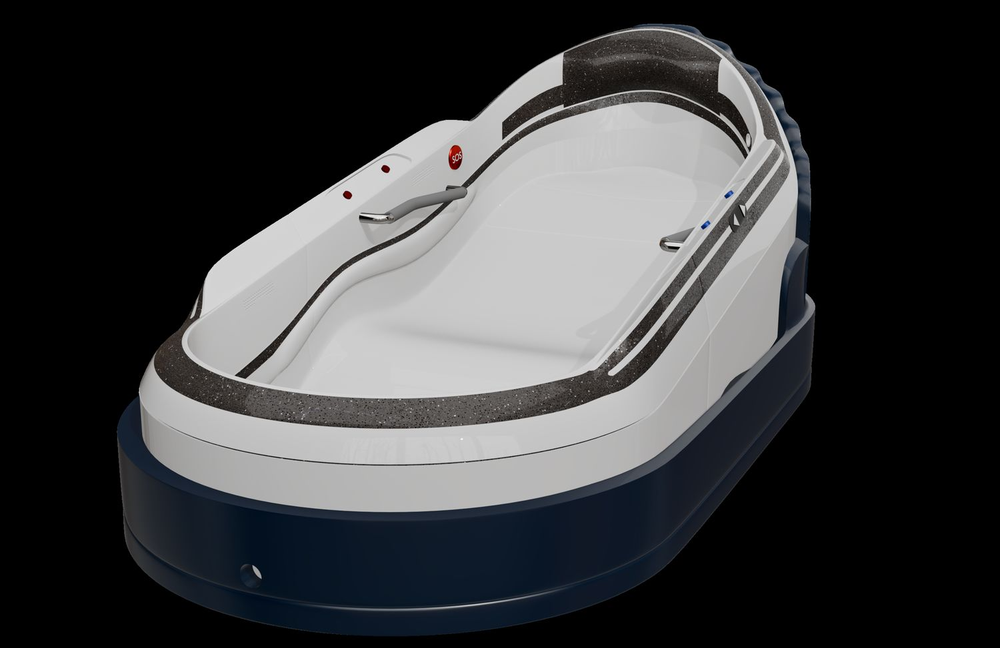

> **分类**：建模渲染 ｜ **编号**：02-12 ｜ **完成时间**：2024-12-26
>
> **使用工具**：Blender / Rhino / Photoshop
>
> **标签**：产品设计 · 适老化 · 浴缸 · 建模

## 说明

《产品系统设计》课程作业。针对老年人洗浴的安全性与便利性做了一轮完整的产品设计：从市场与用户调研出发，把目标定在「提升安全性、改善舒适性、增强便利性、促进独立性、符合审美」五点上，最后落到一个可坐卧、带安全扶手与紧急呼救（SOS 按钮）的适老化浴缸。

## 调研依据

- 市场规模：2023 年中国老人浴缸市场约 45 亿元，预计 2025 年扩至 60 亿元，年复合增长率约 15%
- 品类结构：独立式浴缸是收入占比最大的种类，家用领域需求最高
- 政策背景：「十四五」规划纲要提出支持 200 万户特殊困难高龄、失能、残疾老年人家庭做适老化改造
- 竞品参照：Kohler、Maax、Cheviot、Ariel、Toto、Hansgrohe、Roca、Mirolin、Jacuzzi、Teuco、Americh
- 用户结论：购买时最看重功能，造型上椭圆形最受欢迎

## 设计要点

- **内部要素**：座椅、靠背、扶手、防滑表面
- **外部要素**：紧凑尺寸、简约外观、可调节、防水密封
- **具体实现**：高度与倾斜角度可调；扶手内置，位置排布成多个角度都便于施力；内壁与外底采用带颗粒纹理的软质复合塑料；中部座位做宽敞，符合人体工程学
- **推进节奏**：前期调研 → 头脑风暴 → 设计构思 → 设计展开 → 草图绘制 → 效果图绘制 → 建模与展板制作 → 设计展望（文档里的时间计划表落在 2025-01-17 ～ 01-30）

## 预览

## 素材

| 项目 | 数量 |
| --- | --- |
| 源文件 | 42 个 / 243.2 MB |
| 构成 | 图片 35 个 · 三维工程 3 个 · 文档 4 个 |
