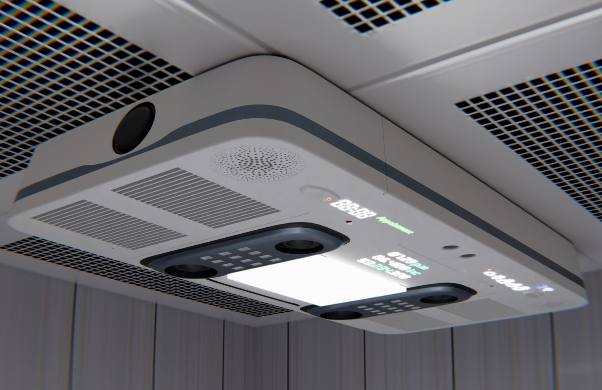
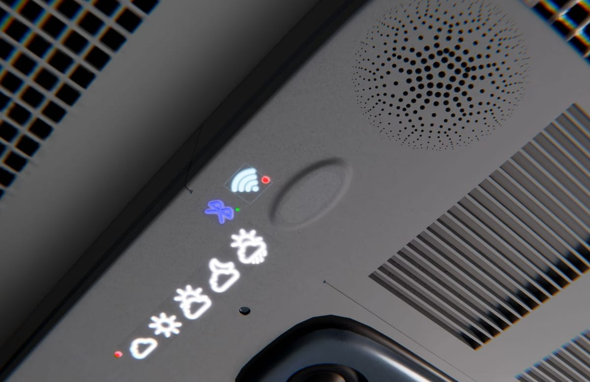

> **分类**：建模渲染 ｜ **编号**：02-13 ｜ **完成时间**：2025-05-13
>
> **使用工具**：Blender / Photoshop
>
> **标签**：产品设计 · 家电 · 建模 · 渲染

## 说明

吊顶式智能浴霸（浴室暖风机）外观设计。包含正面/侧面/安装场景的多角度渲染、Wi-Fi 与天气图标等界面元素、细节特写（出风口、灯板、显示屏），以及最终展板与建模源文件。

## 预览

## 素材

| 项目 | 数量 |
| --- | --- |
| 源文件 | 31 个 / 136.9 MB |
| 构成 | 图片 28 个 · 三维工程 3 个 |

