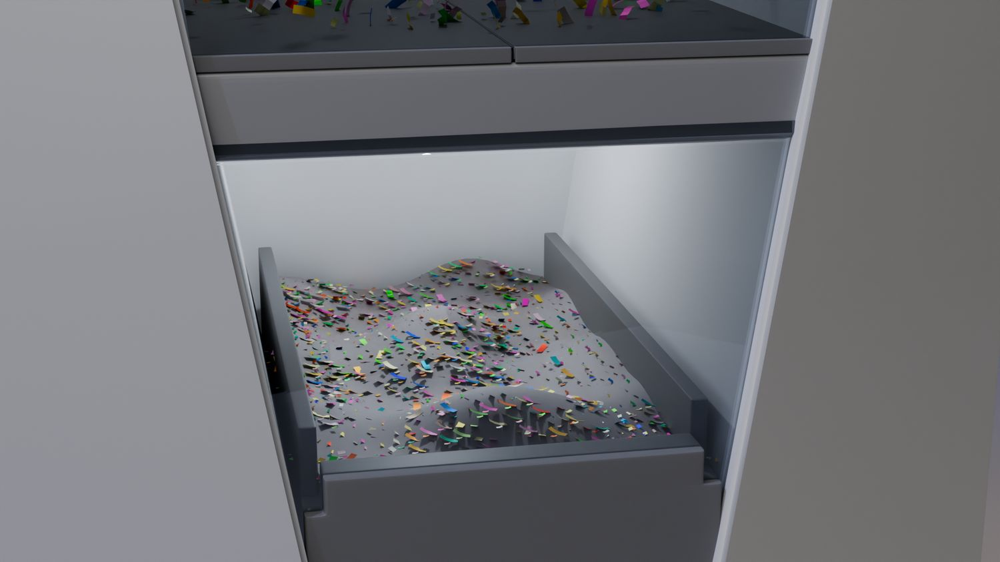
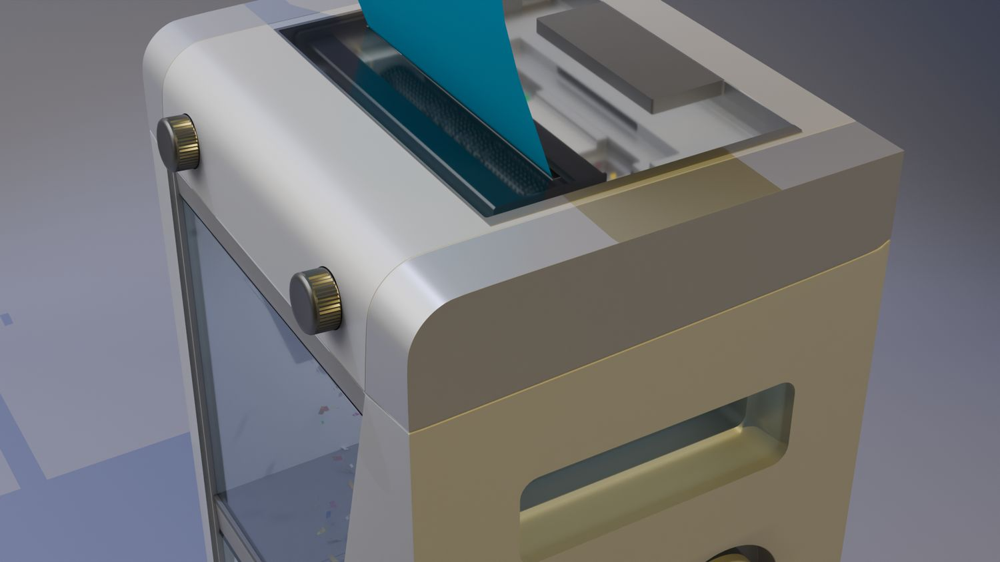
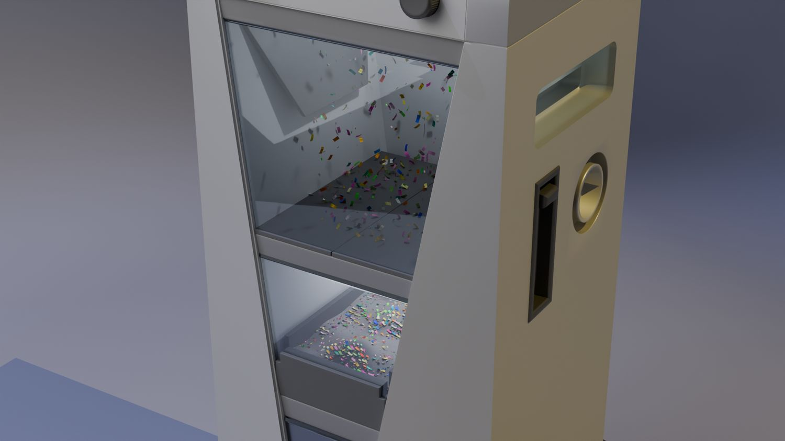
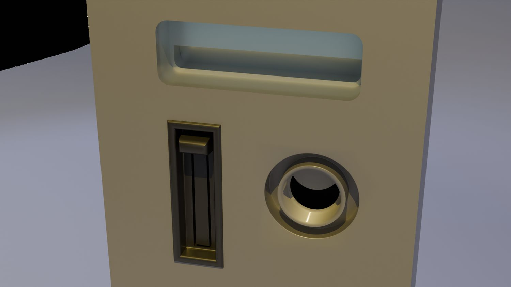

> **分类**：建模渲染 ｜ **编号**：02-14 ｜ **完成时间**：2025-06-03
>
> **使用工具**：Blender / Photoshop
>
> **标签**：产品设计 · 办公用品 · 建模 · 渲染

## 说明

桌面级碎纸机设计。包含白模结构预览、材质渲染（白+香槟金配色）、使用场景渲染、碎纸效果特写，以及「GREEN SHREDDERS」展板与配色方案。

## 预览

## 素材

| 项目 | 数量 |
| --- | --- |
| 源文件 | 31 个 / 147.6 MB |
| 构成 | 图片 29 个 · 三维工程 2 个 |

