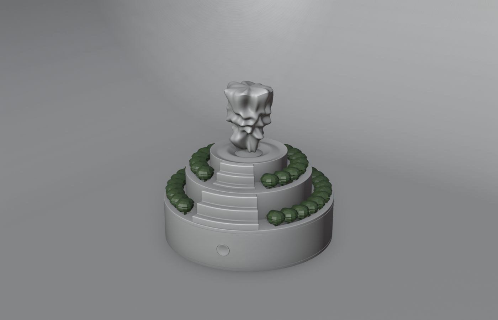

> **分类**：建模渲染 ｜ **编号**：02-15 ｜ **完成时间**：2025-03-22
>
> **使用工具**：Blender / Photoshop
>
> **标签**：产品设计 · 家居 · 香薰 · 建模

## 说明

一款以「茶」为主题的香薰加湿产品：圆形玻璃罩内是绿意山丘造型，出雾时形成云雾缭绕的茶山意境。包含多角度渲染、出雾效果对比、细节特写、展板与 Blender 源文件。

## 预览

## 素材

| 项目 | 数量 |
| --- | --- |
| 源文件 | 29 个 / 133.6 MB |
| 构成 | 图片 27 个 · 三维工程 2 个 |

