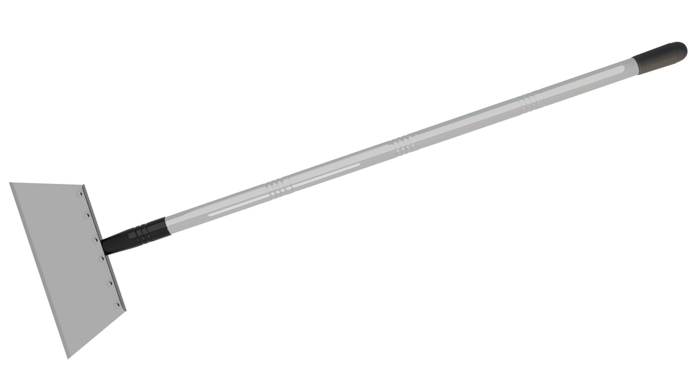
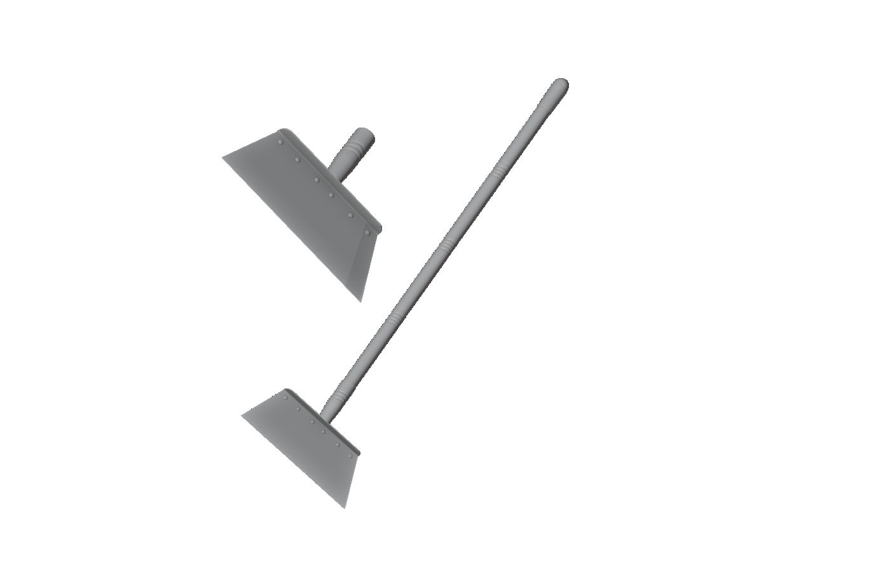

> **分类**：建模渲染 ｜ **编号**：02-16 ｜ **完成时间**：2024-08-12
>
> **使用工具**：Blender / Photoshop
>
> **标签**：产品设计 · 五金 · 工具 · 建模

## 说明

以钣金折弯为主体的折叠清扫工具设计。含白模、金属材质渲染、多角度展示、尺寸阶梯对照图（103/313/463/31.4 等规格）与展板。文件夹名原为「最折磨的一集」。

*文件 24 个 / 305.9 MB · 制作于 2024-08-12*

## 预览

