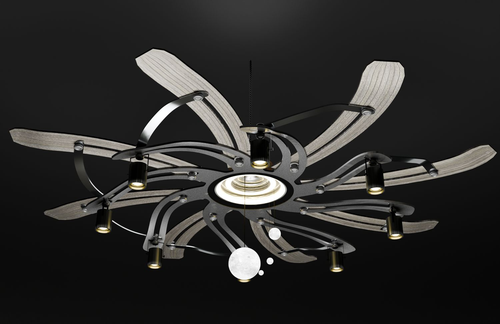

> **分类**：三维建模 ｜ **编号**：02-17 ｜ **完成时间**：2025-01-06
>
> **使用工具**：Blender / Rhino / Photoshop
>
> **标签**：产品设计 · 灯具 · 建模 · 渲染

## 说明

多臂机械感吊灯设计，采用连杆结构展开如花瓣。含金属材质渲染、暗场氛围渲染、局部细节（连接件、灯头、线材），以及展板。

## 预览

## 素材

| 项目 | 数量 |
| --- | --- |
| 源文件 | 22 个 / 167.7 MB |
| 构成 | 图片 17 个 · 三维工程 5 个 |

