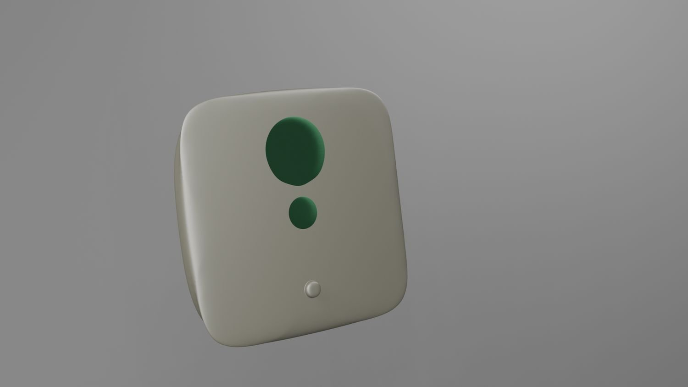

> **分类**：建模渲染 ｜ **编号**：02-18 ｜ **完成时间**：2023-08-15
>
> **使用工具**：Blender
>
> **标签**：产品设计 · 家居 · 开关 · 建模

## 说明

墙面开关面板系列设计练习，多种按键布局与配色（含肌理面板）。产出为多张产品渲染与 Blender 源文件。

*源文件 11 个 / 81.5 MB · 制作于 2023-08-15*

## 预览

