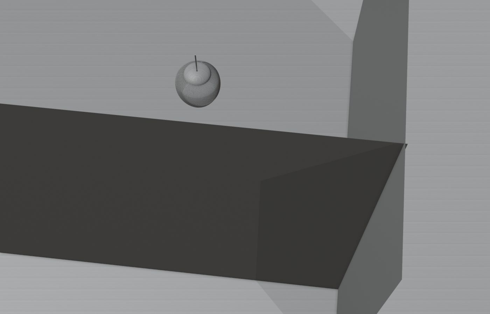

> **分类**：三维建模 ｜ **编号**：02-18 ｜ **完成时间**：2024-03-22
>
> **使用工具**：Blender
>
> **标签**：产品设计 · 家居 · 开关 · 建模

## 说明

墙面开关面板系列设计练习，多种按键布局与配色（含肌理面板）。产出为多张产品渲染与 Blender 源文件。

## 预览

## 素材

| 项目 | 数量 |
| --- | --- |
| 文件 | 11 个 / 81.5 MB |
| 图片 | 14 张 |
| 视频 | 0 段 |

制作时间跨度：2024-03-07 ～ 2024-03-22
