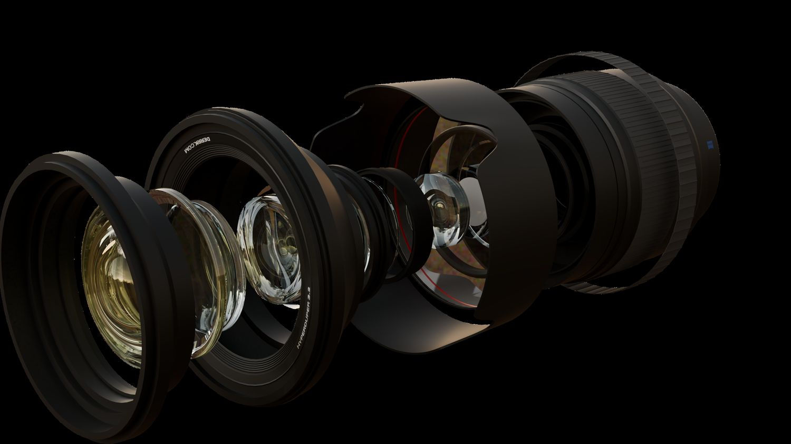
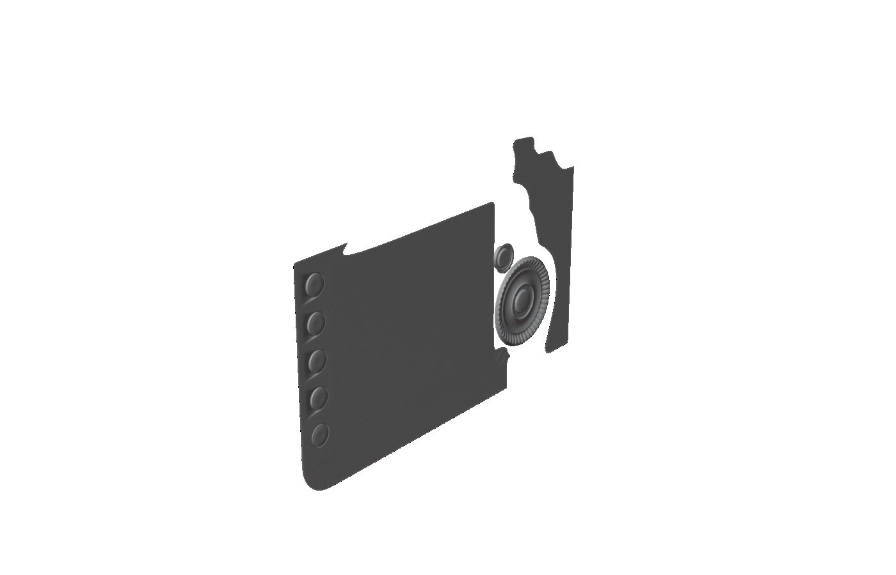
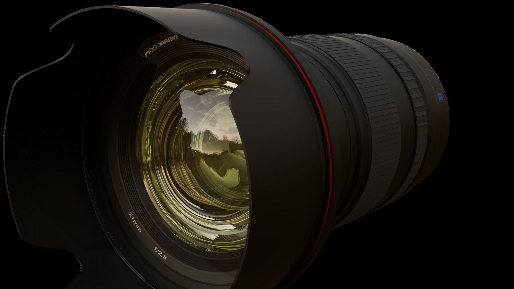
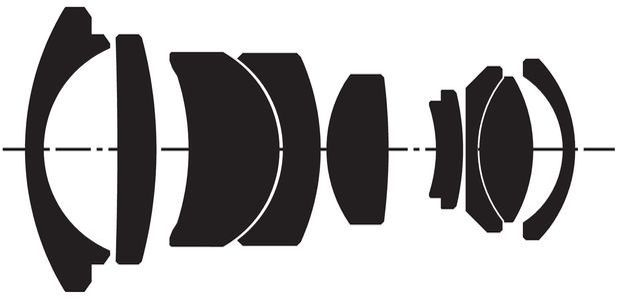

> **分类**：三维建模 ｜ **编号**：02-19 ｜ **完成时间**：2025-01-06
>
> **使用工具**：Blender / Photoshop
>
> **标签**：爆炸图 · 结构 · 相机 · 建模

## 说明

这是一组以相机机身与镜头为对象的结构爆炸图。主体是 Canon 5D Mark IV 机身和镜头，把它们拆开来表达结构关系。整个周期从 2024-11-18 到 2025-01-06，使用 Blender 建模与渲染，Photoshop 做后期。

爆炸图的 Blender 工程是自己建的，包括模型、爆炸图搭建和最终的渲染出图（1.png / 2.png），工程文件在目录里留了两份（爆炸图.blend 与爆炸图.blend1）。为了让镜头的内部结构有依据，过程中收集了一批镜头内部结构、镜片组解析的专业参考图，以及 Zeiss / HyperDupr 的镜头参数卡，作为对照资料。

## 做了什么

- 对象：Canon 5D Mark IV 机身与配套镜头。
- 范围：只做机身与镜头的结构爆炸图表达，不涉及其他器材。
- 做法：在 Blender 里自建模型和爆炸图工程，完成拆解与渲染；出图后用 Photoshop 处理。
- 参考资料：镜头内部结构、镜片组解析的专业参考图，以及 Zeiss / HyperDupr 镜头参数卡；另有一批屏幕截图和网络参考图（如 v2-*_1440w.jpg）。
- 成果构成：目录共 28 个文件，图片 26 个、三维工程 2 个；成图可见 1.png、2.png。
- 过程留存：目录里还留着两张屏幕截图（2024-11-23、2024-11-24）以及 R-C.png 等过程文件。

## 预览

## 素材

| 项目 | 数量 |
| --- | --- |
| 源文件 | 28 个 / 96.8 MB |
| 构成 | 图片 26 个 · 三维工程 2 个 |

制作时间跨度：2024-11-18 ～ 2025-01-06
