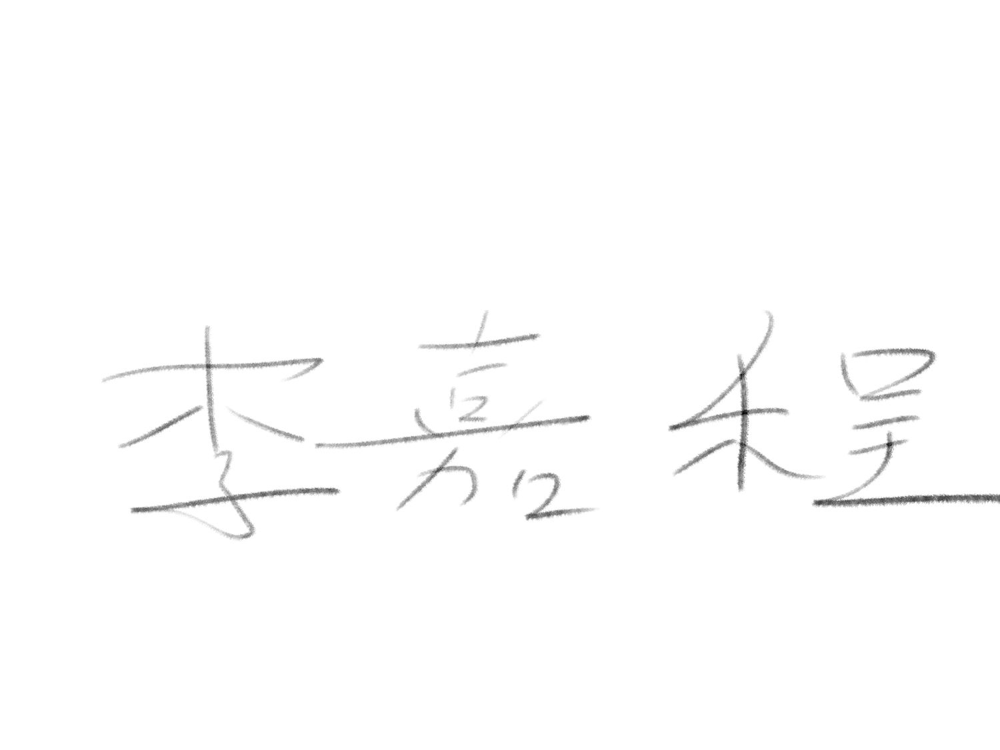

> **分类**：三维建模 ｜ **编号**：02-21 ｜ **完成时间**：2024-12-04
>
> **使用工具**：Blender / Photoshop
>
> **标签**：文创 · 书签 · 建模 · 渲染

## 说明

宝鸡文理学院校园文创产品（金属书签）设计，含蓝白款与红色款多角度渲染、展板（生活用品类 · 李嘉程 · 机械工程学院）与原创承诺书。

## 预览

## 素材

| 项目 | 数量 |
| --- | --- |
| 文件 | 11 个 / 97.2 MB |
| 图片 | 11 张 |
| 视频 | 0 段 |

制作时间跨度：2024-12-01 ～ 2024-12-04
