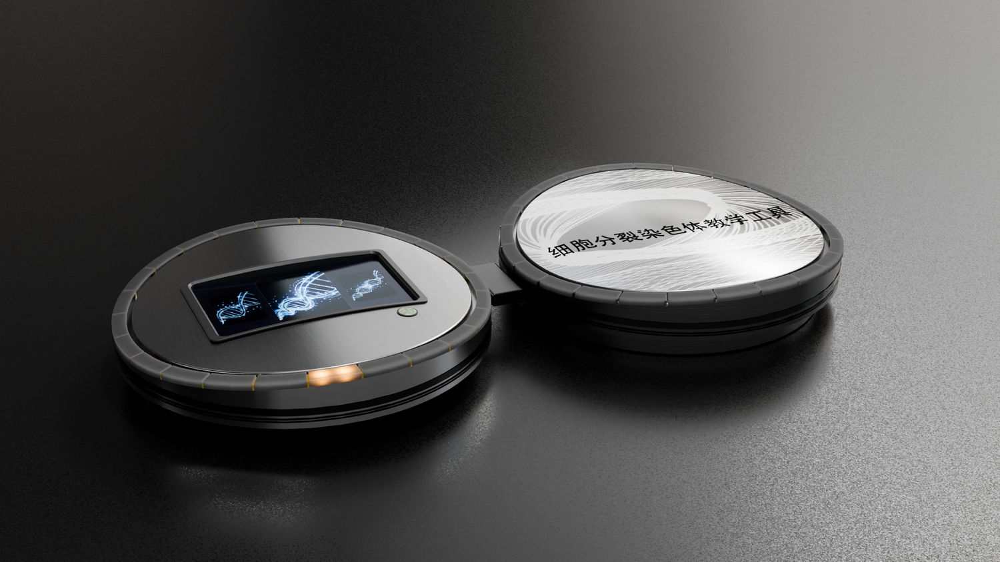
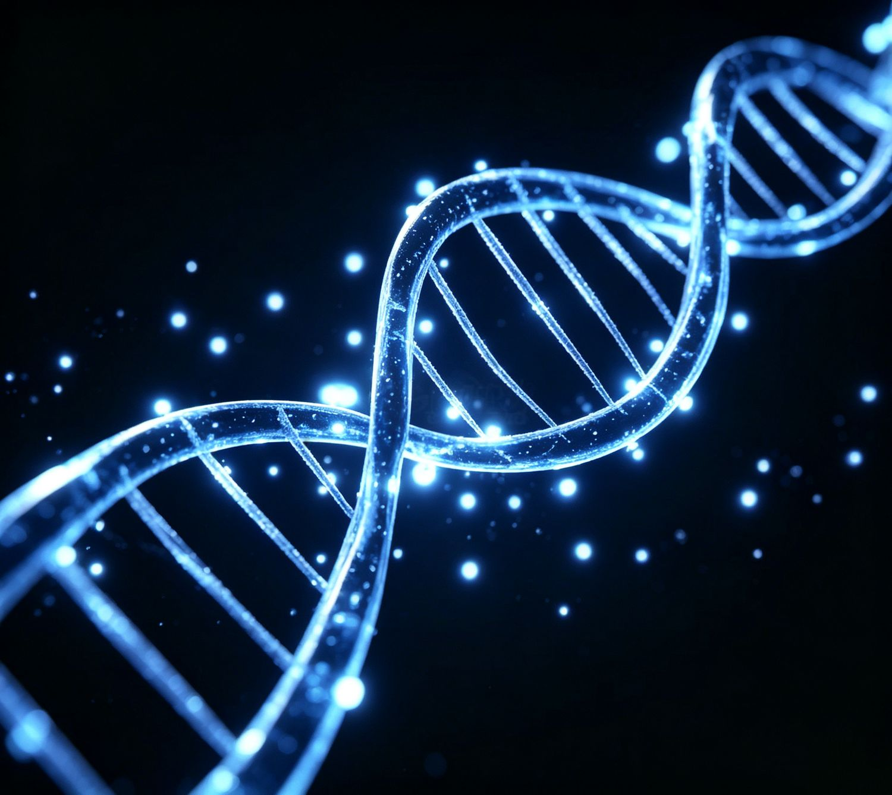

> **分类**：三维建模 ｜ **编号**：02-22 ｜ **完成时间**：2026-09-18
>
> **本项目含 4 部分**：机械手套与桌面雪花球建模 / DNA 外壳设计 / 产品外壳工程（SolidWorks / Plasticity）/ 桌面雪花球场景渲染
>
> **使用工具**：Blender / SolidWorks / Plasticity / Photoshop / Rhino
>
> **标签**：机械 · 手套 · 雪花球 · 建模 · DNA · 外壳 · 钣金 · 工程 · 场景

## 说明

2026 年 8–9 月这一批产品建模与工程工作。整理作品集时发现，原本拆成四条的其实是同一组东西——证据就在文件里：`空心铰链.STEP` 同时出现在「DNA 外壳」和「产品外壳工程」两个目录，`手套_*.plasticity` 与 `外壳改_*.plasticity` 在同一套工程文件里，桌面雪花球的 `.obj/.mtl` 又混在机械手套的目录下。

按做了什么拆开看是四块：

- **机械手套与桌面雪花球**：外骨骼手套的结构建模，加桌面景观雪花球的造型
- **DNA 外壳设计**：以 DNA 双螺旋为视觉母题的产品外壳，含 `摄像头.SLDPRT`、`空心铰链.STEP`
- **产品外壳工程**：SolidWorks 的零件与总装（.SLDPRT / .SLDASM）、钣金总装 .STEP、外壳改型（.stp / .blend / .obj / .plasticity），以及整套「总-视觉版本3」图纸
- **桌面雪花球场景渲染**：把雪花球放进场景里做的合成展示

一个作品里同时有「造型建模」和「能拿去加工的工程文件」，是这一批比较特别的地方：外壳改型的中间版本在 Plasticity 里逐日留档（day1 / hour1 / hour2 / autosave），看得出改型是反复推的。

## 预览

## 素材

| 项目 | 数量 |
| --- | --- |
| 源文件 | 254 个 / 556.4 MB |
| 构成 | 图片 64 个 · 三维工程 187 个 · 其它 3 个 |
