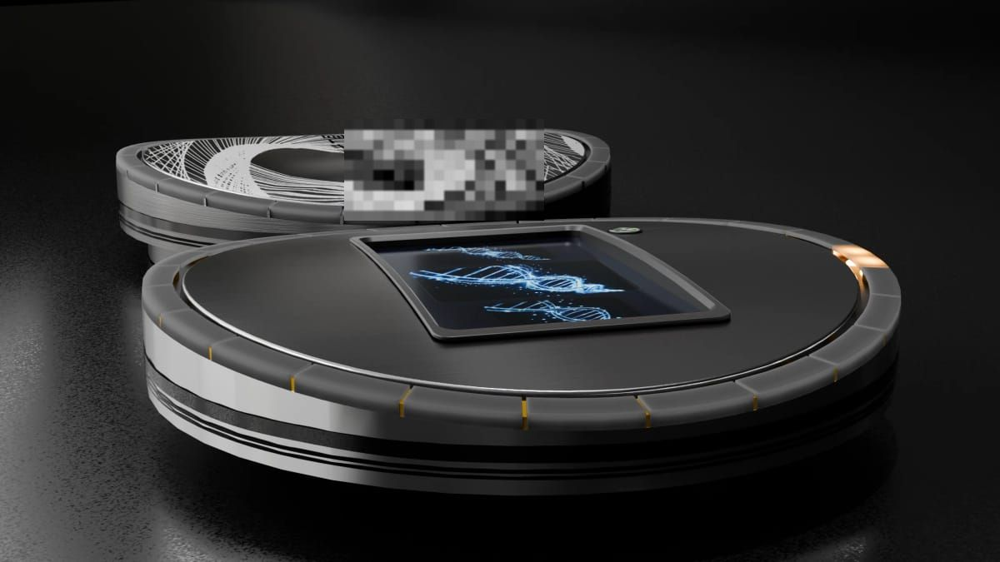

> **分类**：建模渲染 ｜ **编号**：02-23 ｜ **完成时间**：2026-09-08
>
> **使用工具**：Blender / Photoshop
>
> **标签**：DNA · 外壳 · 建模 · 视觉

## 说明

以 DNA 双螺旋为母题的产品外壳设计。文件夹内主要是「生成高清图片」系列（蓝色发光 DNA 视觉、金属拉丝材质对比）与手部皮肤材质贴图（Map / Gun Hold 的 Albedo、Displacement 等），说明这个项目主要在打磨材质与视觉表现。

## 预览

## 素材

| 项目 | 数量 |
| --- | --- |
| 源文件 | 54 个 / 121.6 MB |
| 构成 | 图片 34 个 · 三维工程 17 个 · 其它 3 个 |

制作时间跨度：2021-03-25 ～ 2026-09-08
