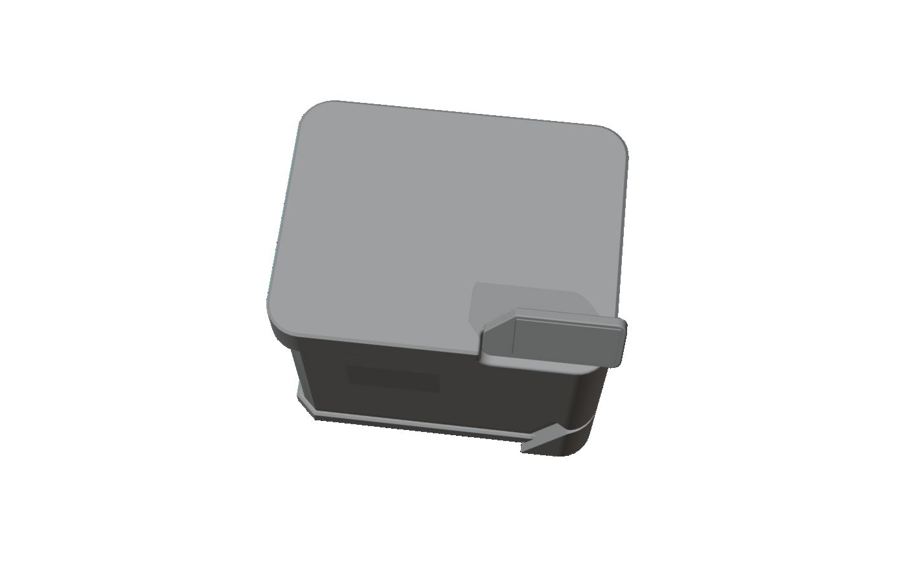

> **分类**：三维建模 ｜ **编号**：02-24 ｜ **完成时间**：2026-09-16
>
> **使用工具**：SolidWorks / Plasticity / Rhino / Blender
>
> **标签**：工程 · 钣金 · 外壳 · 建模

## 说明

面向量产的产品外壳工程文件：SolidWorks 的零件（.SLDPRT）与总装（.SLDASM）、钣金总装 .STEP、空心铰链结构、外壳改型（.stp/.blend/.obj/.plasticity）、9-10BACK 版本的 Rhino 三维模型，以及整套「总-视觉版本3」图纸。体积较大的装配体原件未复制，已在待补清单中列出原路径。

## 预览

## 素材

| 项目 | 数量 |
| --- | --- |
| 文件 | 167 个 / 283.0 MB |
| 图片 | 32 张 |
| 视频 | 0 段 |

制作时间跨度：2023-10-08 ～ 2026-09-16
