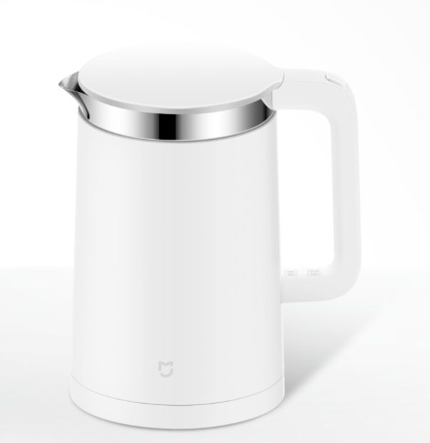
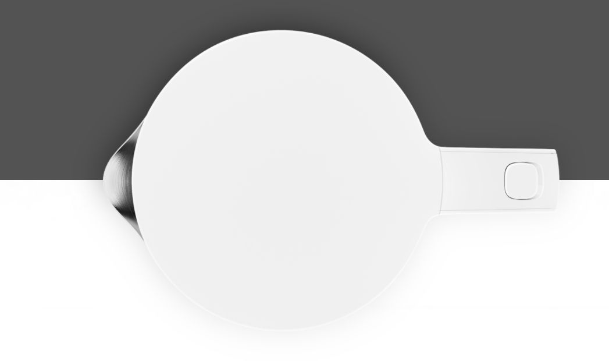

> **分类**：三维建模 ｜ **编号**：02-25 ｜ **完成时间**：2024-01-17
>
> **使用工具**：Rhino
>
> **标签**：Rhino · 建模 · 练习

## 说明

Rhino 建模练习产出（.3dm），含置入参考图的吹风机与米家电水壶等项目。

## 预览

## 素材

| 项目 | 数量 |
| --- | --- |
| 文件 | 15 个 / 14.0 MB |
| 图片 | 3 张 |
| 视频 | 0 段 |

制作时间跨度：2023-09-25 ～ 2024-01-17
