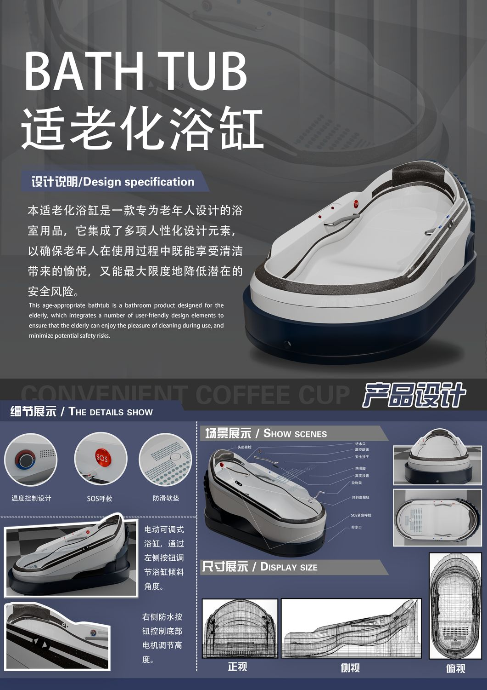
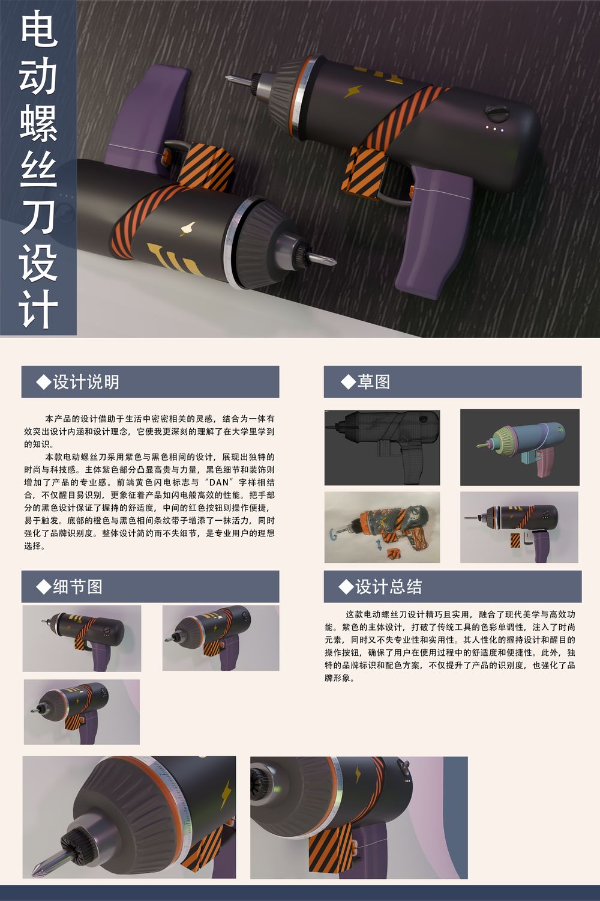
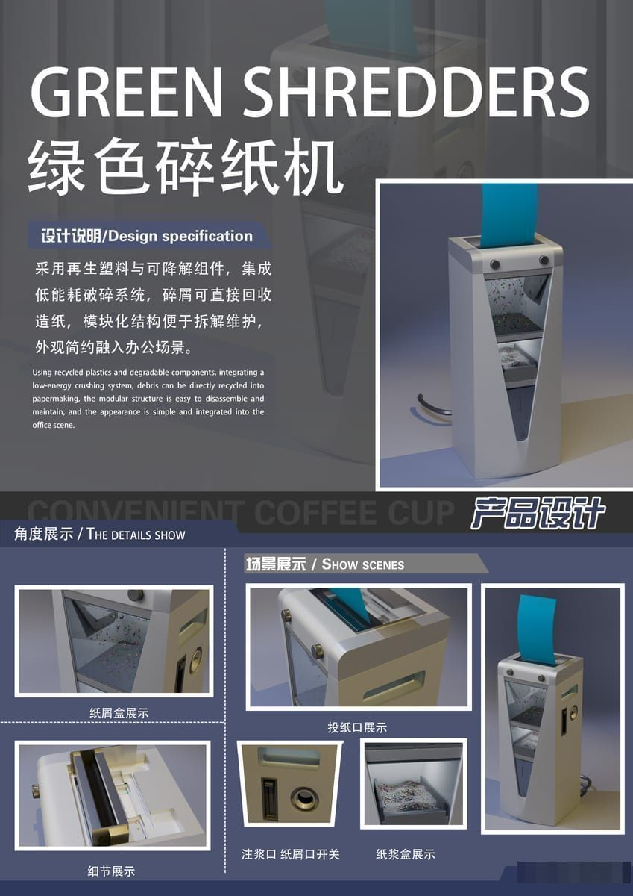

> **分类**：产品渲染 ｜ **编号**：03-27 ｜ **完成时间**：2025-10-17
>
> **使用工具**：Photoshop / Illustrator
>
> **标签**：展板 · 排版 · 渲染

## 说明

把散落在各项目里的最终展板集中放一份，方便一次性浏览与挑选。含：智能骑行穿戴头盔、适老化浴缸、绿色碎纸机、电动裁纸刀/螺丝刀、连杆吊灯、茶艺香薰机、以及一张通用展板。这是做网页时「作品卡片」最适合直接使用的素材。

## 预览

## 素材

| 项目 | 数量 |
| --- | --- |
| 文件 | 7 个 / 50.1 MB |
| 图片 | 7 张 |
| 视频 | 0 段 |

制作时间跨度：2024-06-09 ～ 2025-10-17
