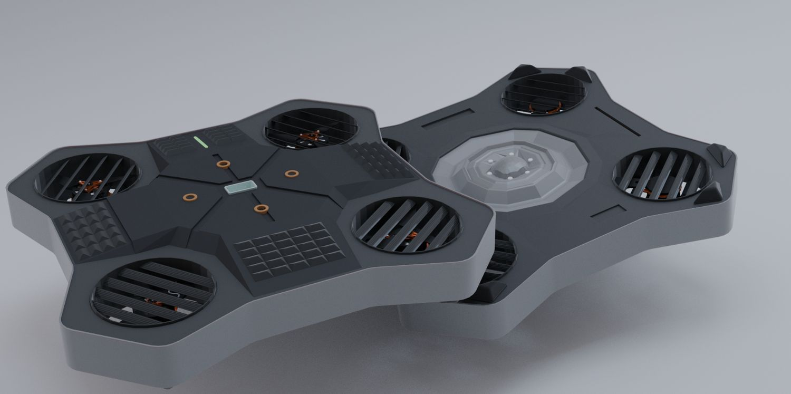
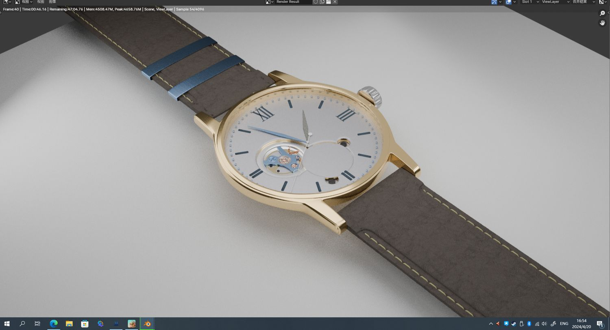

> **分类**：产品渲染 ｜ **编号**：03-28-01 ｜ **完成时间**：2024-04-20
>
> **使用工具**：Blender / Octane
>
> **标签**：渲染 · 产品 · 单体

## 说明

这段时间出的三张单体渲染：一张方形透明香水瓶（粉色水晶瓶盖、浅金色液体，外套透明亚克力），一张两只黑色多旋翼无人机机身（六边形壳体、四格栅桨位）的俯视并置，还有一张金壳白盘机械腕表（罗马数字时标、镂空摆轮）——最后这张是 3ds Max 视口截图，画面里带着软件标题栏与任务栏。

## 预览

## 素材

| 项目 | 数量 |
| --- | --- |
| 源文件 | 3 个 / 0.0 MB |

