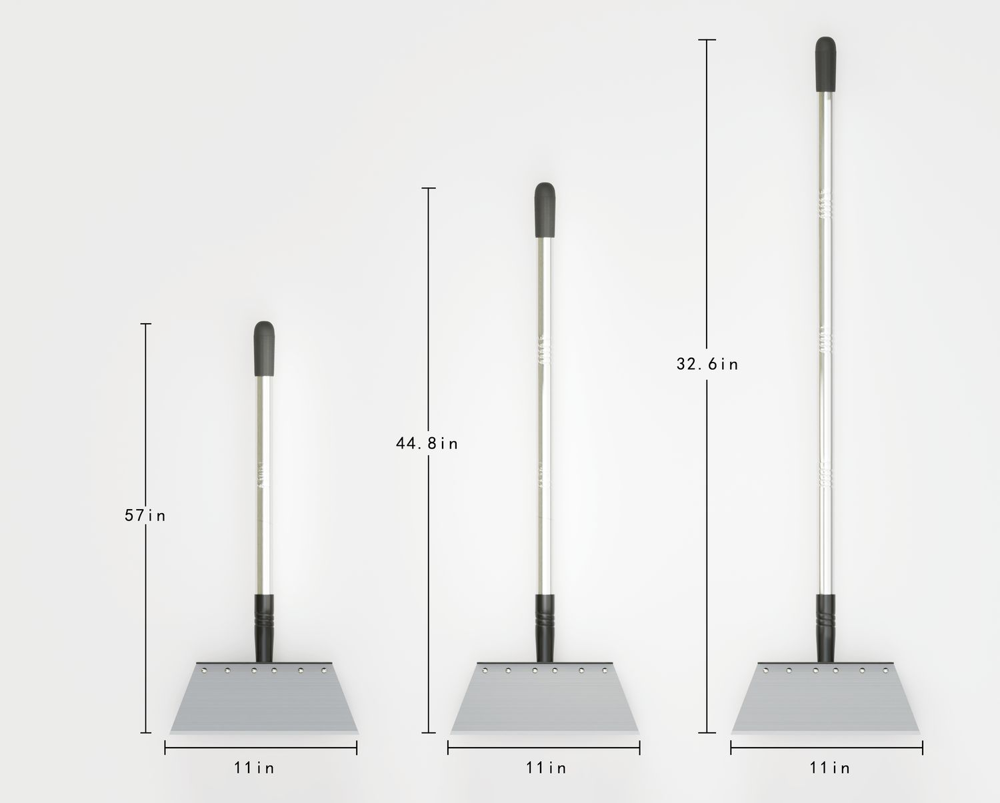

> **分类**：产品渲染 ｜ **编号**：03-28-02 ｜ **完成时间**：2024-08-08
>
> **使用工具**：Blender / Octane
>
> **标签**：渲染 · 产品 · 单体

## 说明

同一把长柄平口铲刀的两种表达：一张 45° 近景渲染（不锈钢铲面六颗铆钉、银色手柄、无接缝浅灰背景），一张正视排列三把的规格图，带尺寸标注线。

## 预览

## 素材

| 项目 | 数量 |
| --- | --- |
| 源文件 | 2 个 / 0.0 MB |

