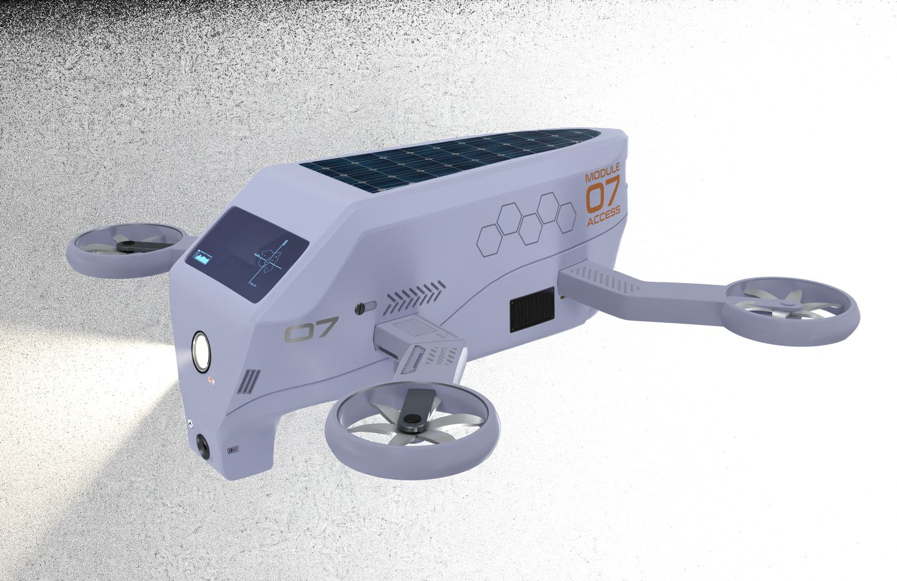
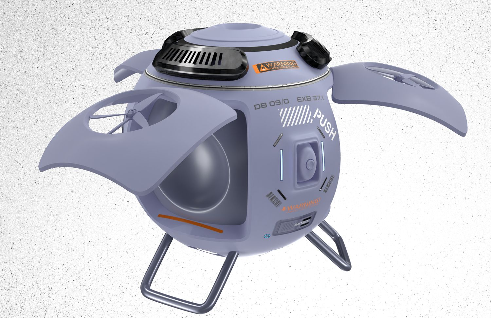
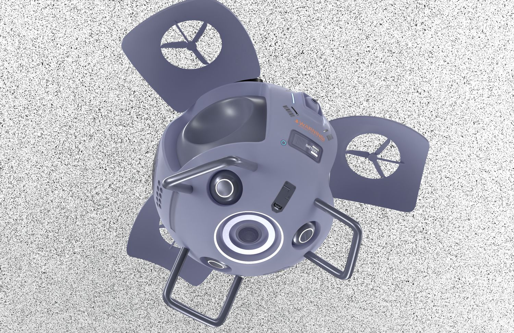
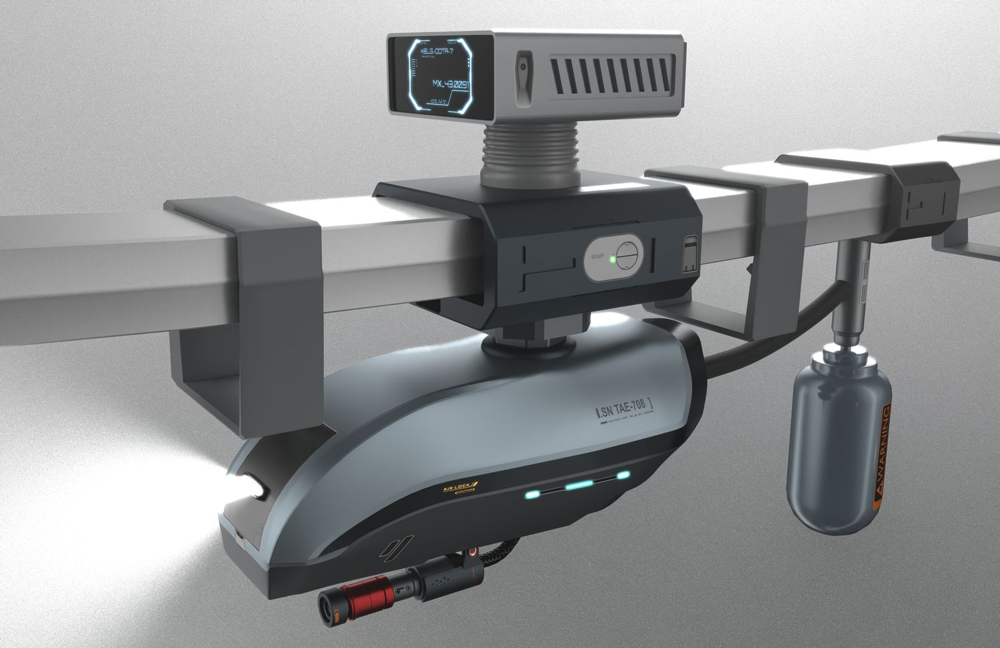
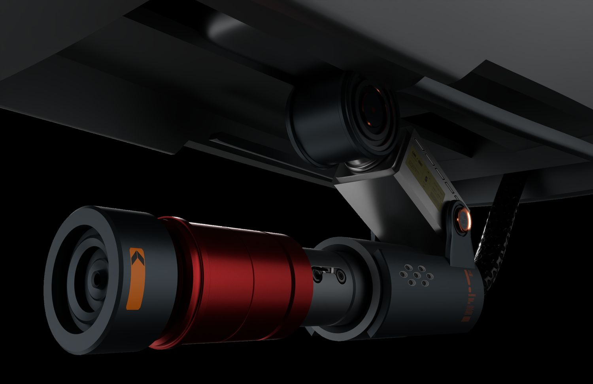

> **分类**：产品渲染 ｜ **编号**：03-28-04 ｜ **完成时间**：2025-05-31
>
> **使用工具**：Blender / Octane
>
> **标签**：渲染 · 产品 · 单体

## 说明

这批最集中：一顶深灰战术头盔的两个布光版本（顶部双镜头模块、透明护目镜上叠 HUD 图标、侧后橙色发光件），一台白色模块化四旋翼无人机的整机与底面细节（蜂窝纹、散热格栅、NO STEP 字样），一台球形桨叶飞行器的前视与俯视，两件机载云台相机载荷（红色阳极氧化圆筒、滑轨与线束），一台轨道悬挂式检测设备（铝型材轨道＋流线滑车），以及一台壁挂智能厨房报警器（球形探头＋触控屏）。

## 预览

## 素材

| 项目 | 数量 |
| --- | --- |
| 源文件 | 10 个 / 0.0 MB |

制作时间跨度：2025-05-15 ～ 2025-05-31
