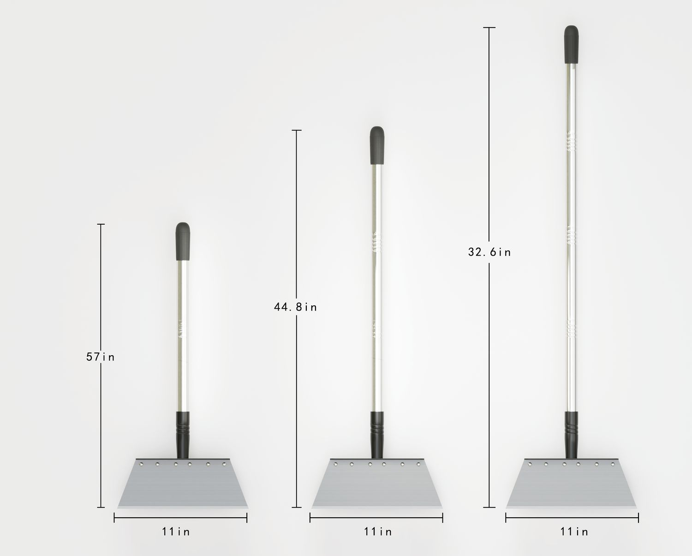
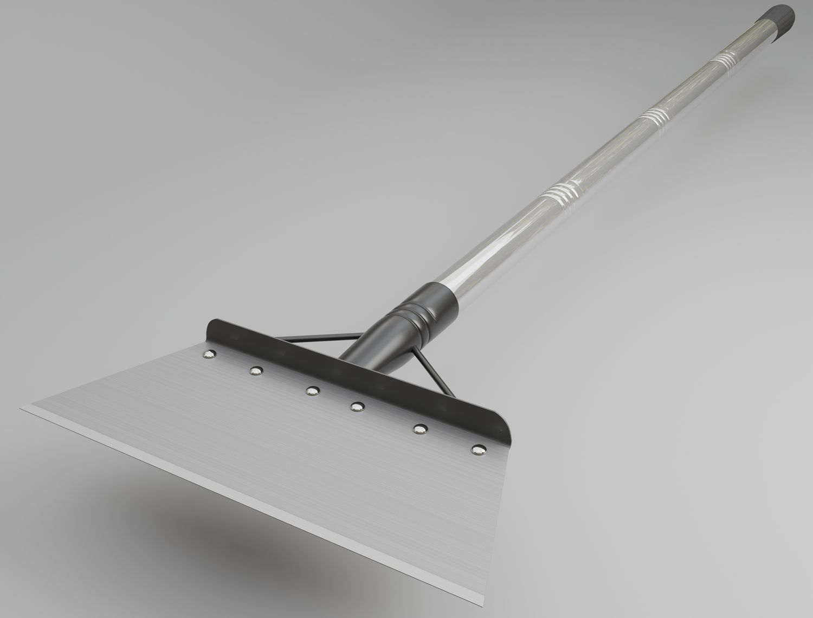
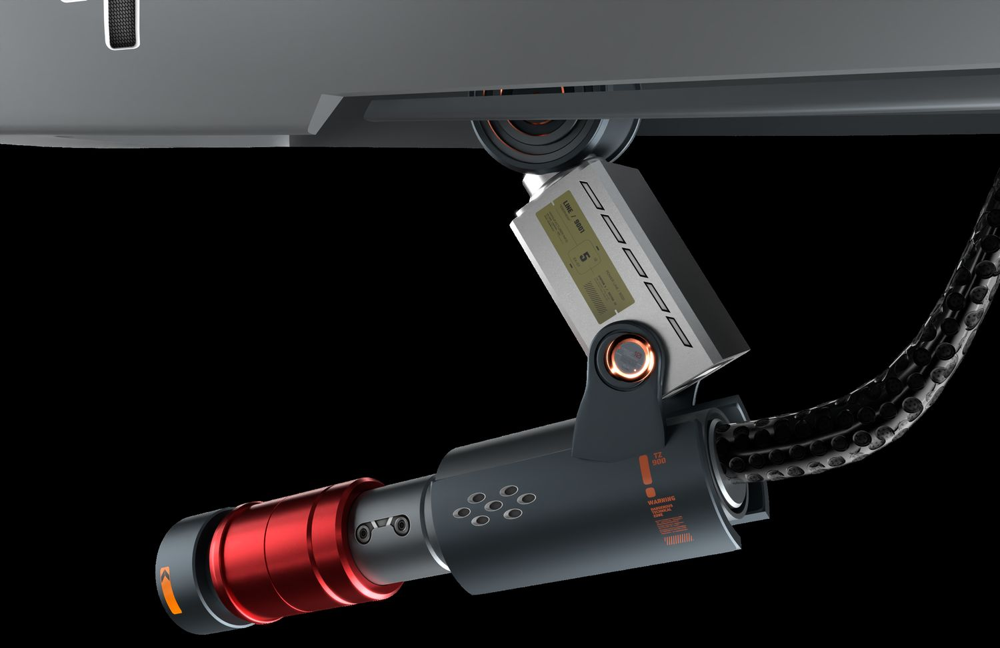

> **分类**：产品渲染 ｜ **编号**：03-28 ｜ **完成时间**：2025-10-17
>
> **使用工具**：Blender / Octane
>
> **标签**：渲染 · 产品 · 静物

## 说明

这是一批独立的产品/静物渲染练习，从 2024-03-25 做到 2025-10-17，每张图各做各的。题材比较散：智能骑行头盔、相机镜头特写、无人机、地灯与落地灯、扫地机器人（三款配色）、喷枪/气泵、香水瓶、条形音箱、CD 机/桌面音箱、腕表、胶带切割器、便携音箱等。

按我自己的分法，这是目前手上「渲染质感」最集中的一组素材。工具是 Blender 加 Octane，输出里包含多张 4K–8K 大图（Image0000–Image0150 系列），也有 1尺寸.png、4k.png 这类单张成图。

## 做了什么

- 对象：一批互相独立的产品与静物单体渲染，不针对某个统一项目。
- 范围：覆盖智能骑行头盔、相机镜头特写、无人机、地灯与落地灯、扫地机器人（三款配色）、喷枪/气泵、香水瓶、条形音箱、CD 机/桌面音箱、腕表、胶带切割器、便携音箱等。
- 做法：在 Blender 里搭建场景，用 Octane 渲染，输出多张 4K–8K 大图，编号集中在 Image0000–Image0150 系列。
- 成果构成：目录共 19 个文件，全部是图片，没有视频；除 Image 系列外另有 0.png、1.png、2.png、4.png、121.png 等单张成图。
- 过程留存：目录里还有两张 2025-10-17 的屏幕截图，以及 untitled.png、捕获.PNG、捕4获.PNG 等文件。

## 预览

## 素材

| 项目 | 数量 |
| --- | --- |
| 源文件 | 19 个 / 238.6 MB |
| 构成 | 图片 19 个 |

制作时间跨度：2024-03-25 ～ 2025-10-17
