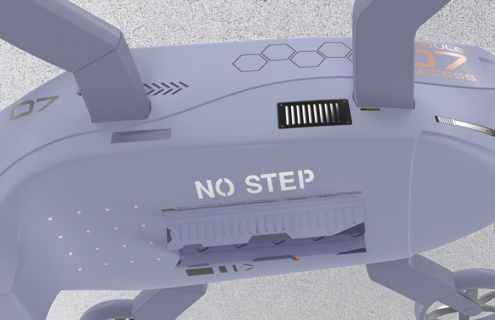
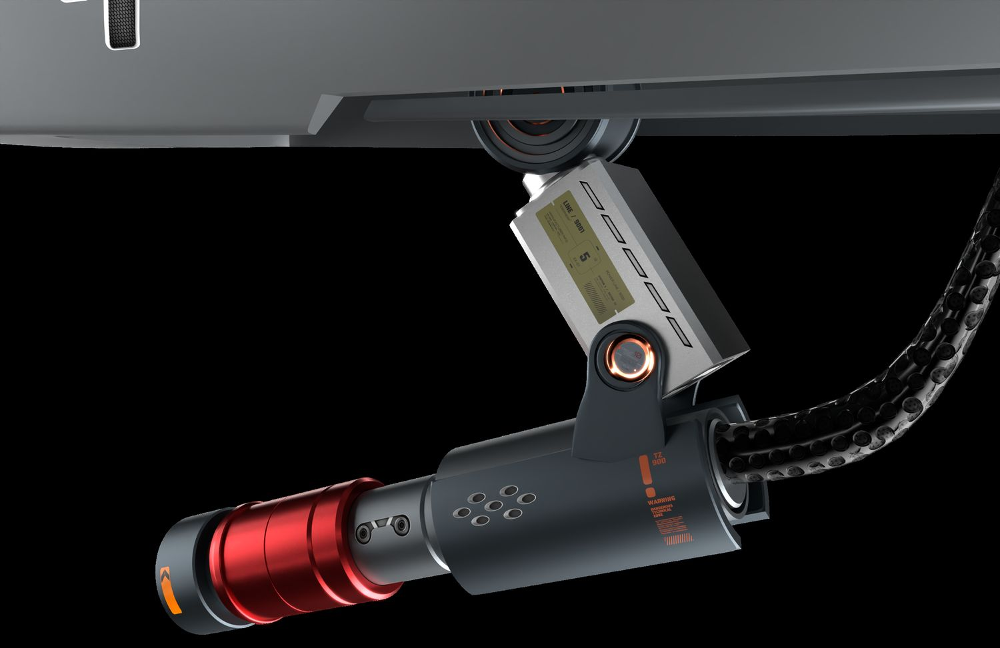

> **分类**：产品渲染 ｜ **编号**：03-29 ｜ **完成时间**：2025-12-05
>
> **使用工具**：Photoshop / Blender
>
> **标签**：展板 · 无人机 · 救援 · 产品设计

## 说明

这块展板做的是一台震后救援用的侦察无人机，副标题定为「灾后搜救场景的无人机概念设计」。版面是 A3 竖版，先在 Blender 里搭出机身和废墟场景，再进 Photoshop 排版，最后导出 PNG；作品集里只有一个源文件，另加一张预览图。

画面上没有堆太多东西，主体就是无人机本身，背景放在地震废墟里，让人一眼看出它在什么环境下使用；这张在作品集里承担的是大场景产品那一条。

## 设计要点

- 使用场景：地震之后的废墟环境，用于救援前的空中侦察与查看。
- 形态与结构：机身是一套模块化巡检平台，下方带探照灯，另有可挂载的载荷模块。
- 板上包含的内容：无人机主体的渲染、地震废墟场景，以及副标题与批次信息；工程里是一份 PSD 源文件，成品导出为 PNG。

## 预览

## 素材

| 项目 | 数量 |
| --- | --- |
| 源文件 | 1 个 / 12.2 MB |
| 构成 | 图片 1 个 |

制作时间跨度：2025-12-05 ～ 2025-12-05
