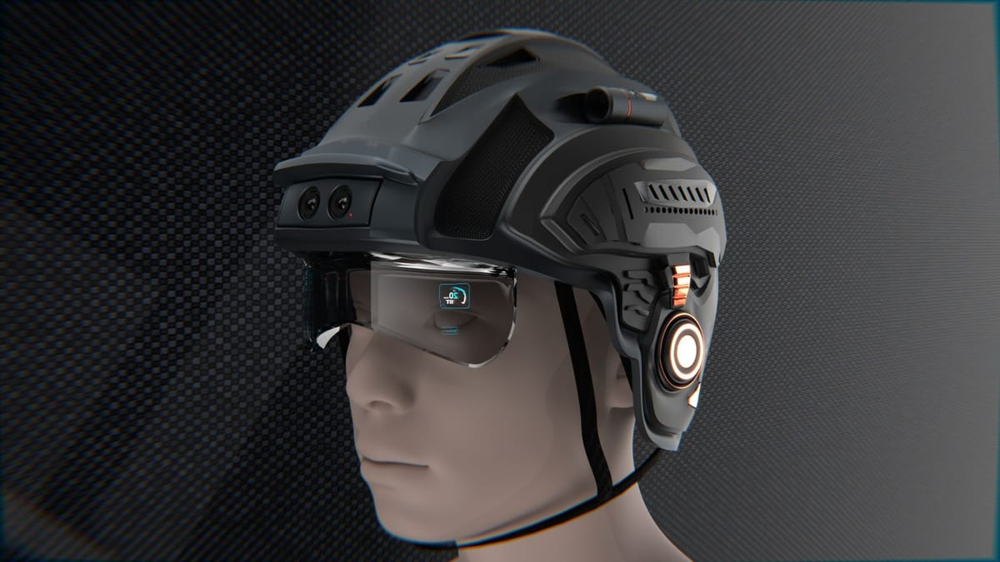
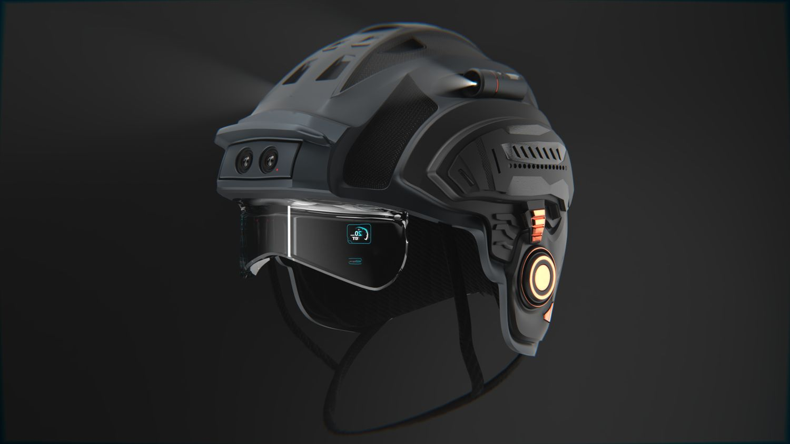
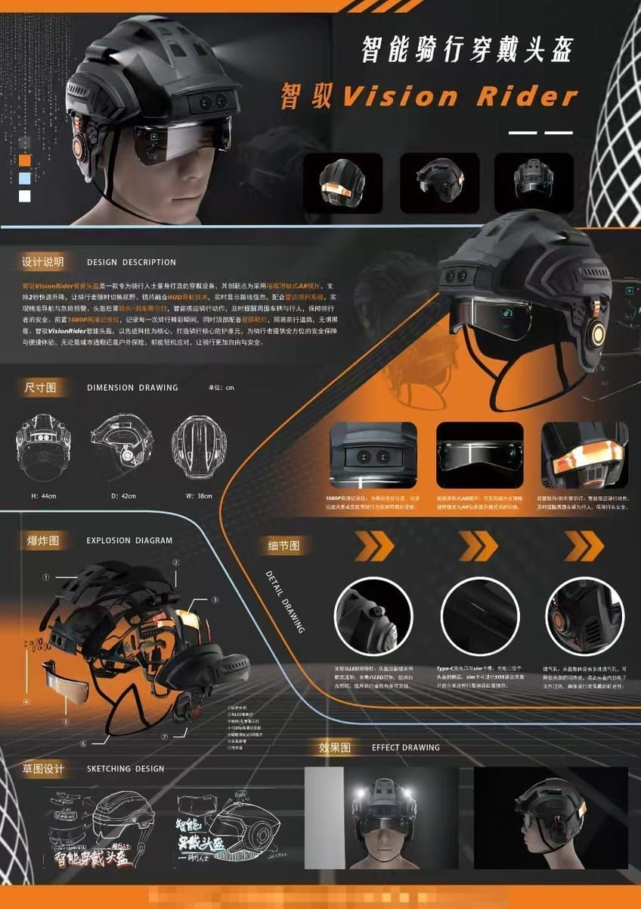

> **分类**：展板 ｜ **编号**：03-30 ｜ **完成时间**：2025-12-05
>
> **使用工具**：Photoshop / Blender
>
> **标签**：展板 · 头盔 · 穿戴 · 产品设计

## 说明

「Vision Rider」这块展板做的是骑行方向的智能穿戴，副标题是「骑行安全方向的智能穿戴产品」。和 03-29、03-31 同属 2025-12-05 这一批，A3 竖版：Blender 出图，Photoshop 排版，导出 PNG，作品集里一个源文件加一张预览图。

板上没有只摆产品图，而是围绕 HUD 显示、模块化结构和安全提示这几组卖点把头盔讲清楚；它和作品集「单渲染作品集」里的头盔渲染是同一套视觉语言，可互相印证。

## 预览

## 素材

| 项目 | 数量 |
| --- | --- |
| 源文件 | 1 个 / 13.1 MB |
| 构成 | 图片 1 个 |

制作时间跨度：2025-12-05 ～ 2025-12-05

## 设计要点

- 使用场景：骑行过程中的安全与信息提示。
- 形态与结构：以头盔为主体，结构按模块化处理。
- 板上包含的内容：HUD 显示、模块化结构与安全提示三组卖点，加上副标题与批次信息；工程是一份 PSD 源文件，成品导出为 PNG。
