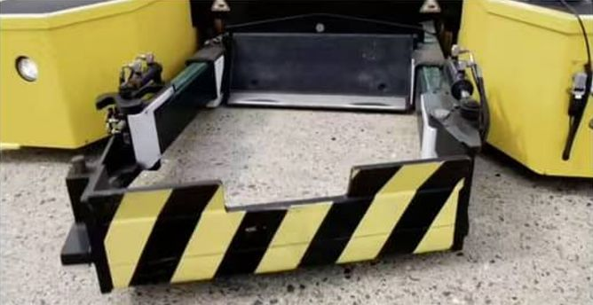
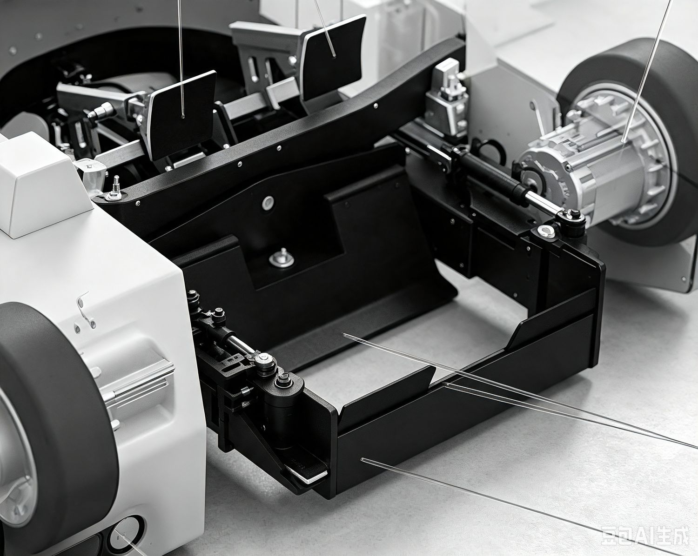
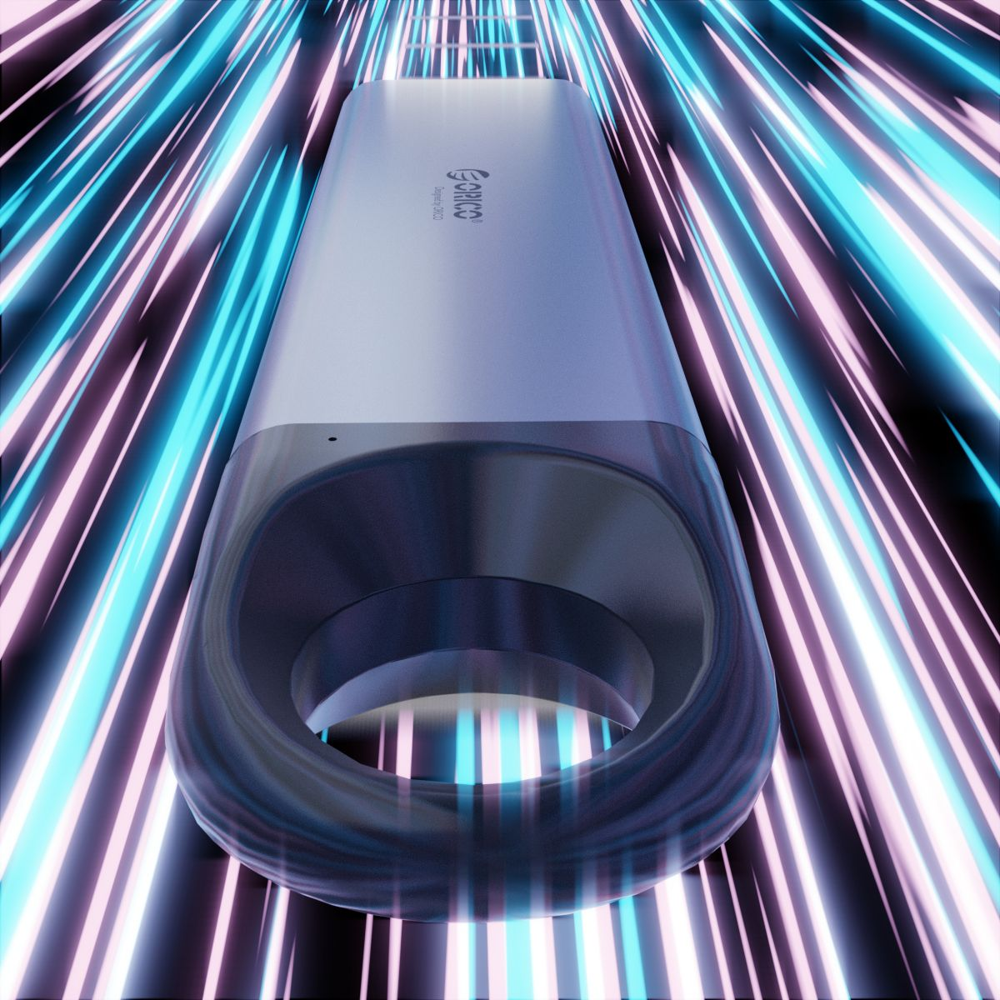

> **分类**：产品渲染 ｜ **编号**：03-32 ｜ **完成时间**：2026-08-10
>
> **使用工具**：Blender / Octane / Photoshop
>
> **标签**：渲染 · 测试 · 产品 · 场景

## 说明

参加视觉设计师岗位测试的作品。题目是基于 ORICO C10 硬盘盒白模（.fbx/.stp）完成白底图、创意场景图与桌面场景图，考核产品光感表现、场景氛围构建与后期合成。文件夹内含成品渲染、原始白模工程、测试说明文档与参考图。

同目录「1 / 2」两个子文件夹里还有另一批面试相关的素材（AGV 行李机器人场景图、超高清细节图等），可一并作为「渲染能力」的补充证据。

## 预览

## 素材

| 项目 | 数量 |
| --- | --- |
| 文件 | 17 个 / 118.7 MB |
| 图片 | 16 张 |
| 视频 | 0 段 |

制作时间跨度：2025-11-11 ～ 2026-08-10
