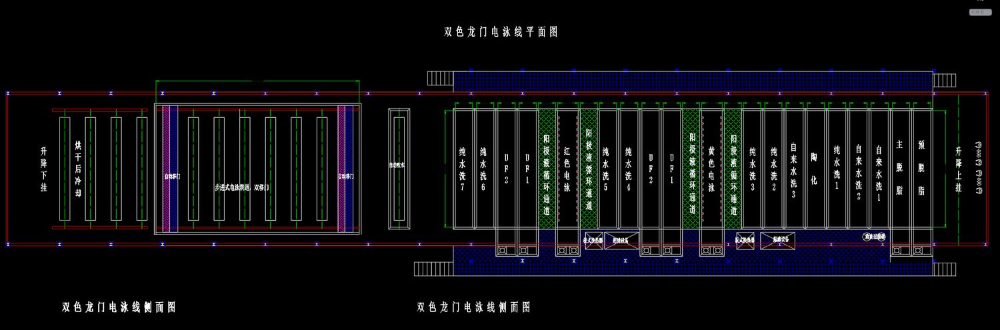
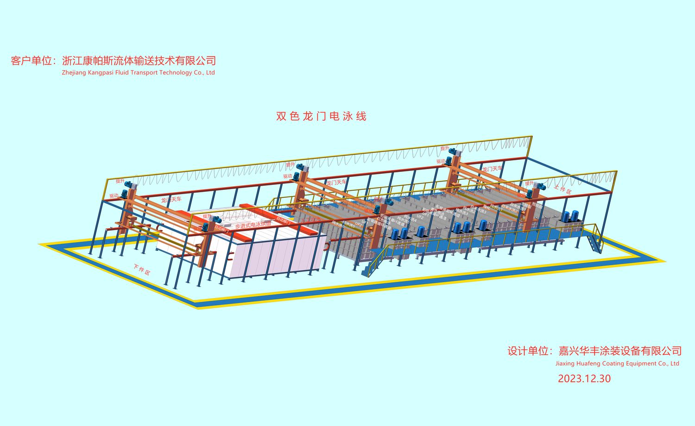

> **分类**：产品渲染 ｜ **编号**：03-33 ｜ **完成时间**：2026-09-29
>
> **使用工具**：Blender / Substance Painter
>
> **标签**：材质 · 贴图 · PBR · 静帧

## 说明

产线动画项目（康帕斯电泳线）用到的 PBR 材质组（BaseColor / Metallic / Normal / Roughness）与相关静帧素材，可作为「材质与渲染技术」的展示。

## 预览

## 素材

| 项目 | 数量 |
| --- | --- |
| 文件 | 160 个 / 181.0 MB |
| 图片 | 8 张 |
| 视频 | 0 段 |

制作时间跨度：2026-09-16 ～ 2026-09-29
