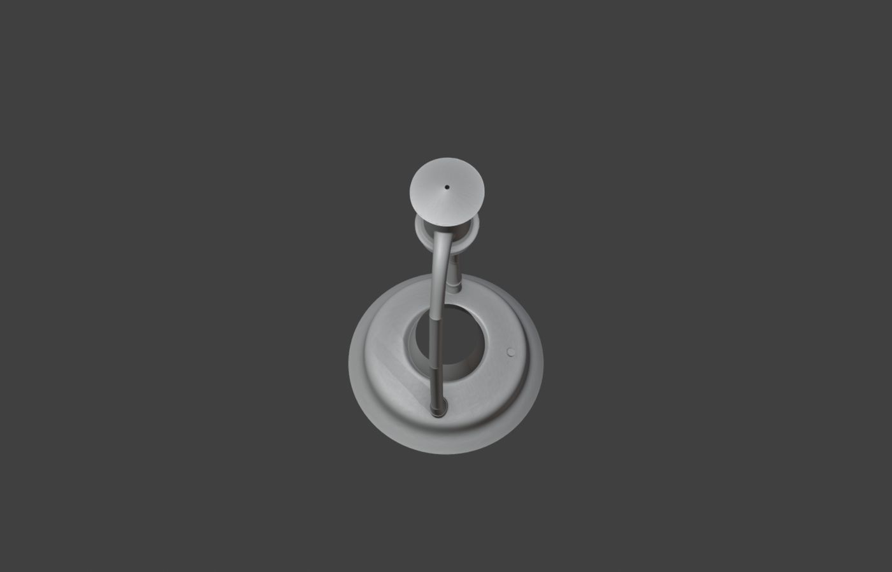

> **分类**：产品渲染 ｜ **编号**：03-34 ｜ **完成时间**：2024-07-17
>
> **使用工具**：Blender
>
> **标签**：渲染 · 静物

## 说明

一些零散的渲染小稿：带散热风扇的电子设备模型、腕表等。可作为过程素材使用。

## 预览

## 素材

| 项目 | 数量 |
| --- | --- |
| 源文件 | 4 个 / 4.7 MB |
| 构成 | 图片 2 个 · 三维工程 2 个 |

