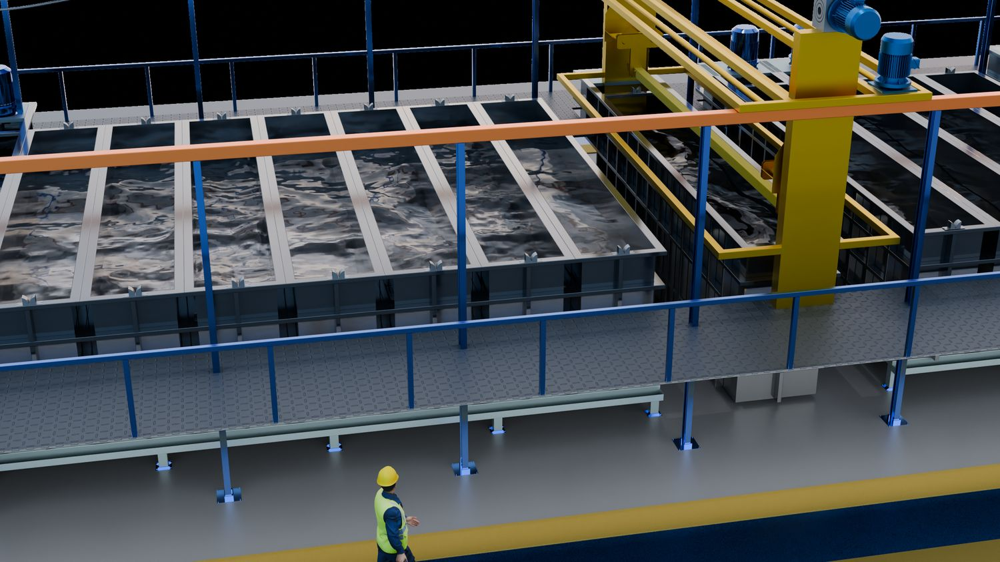
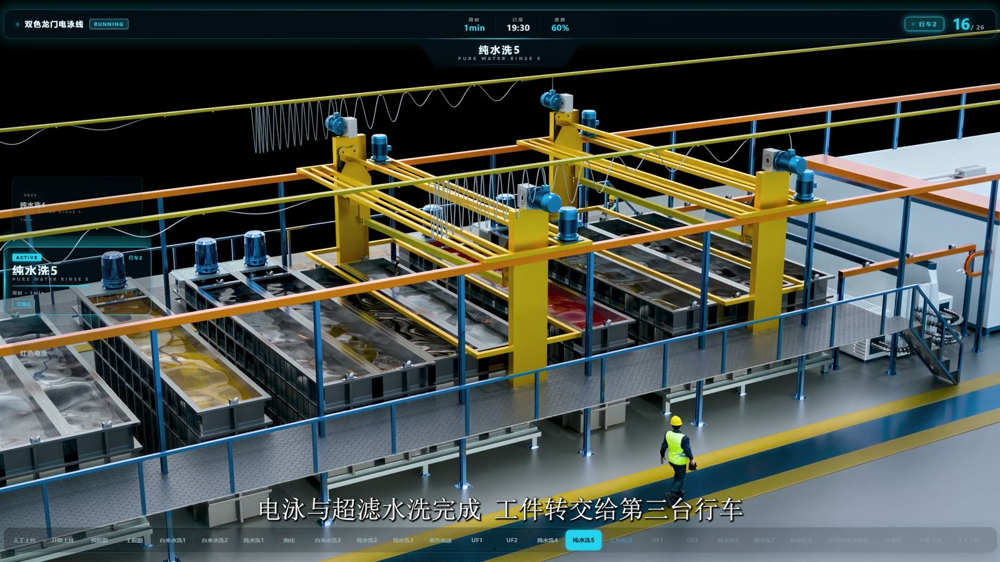
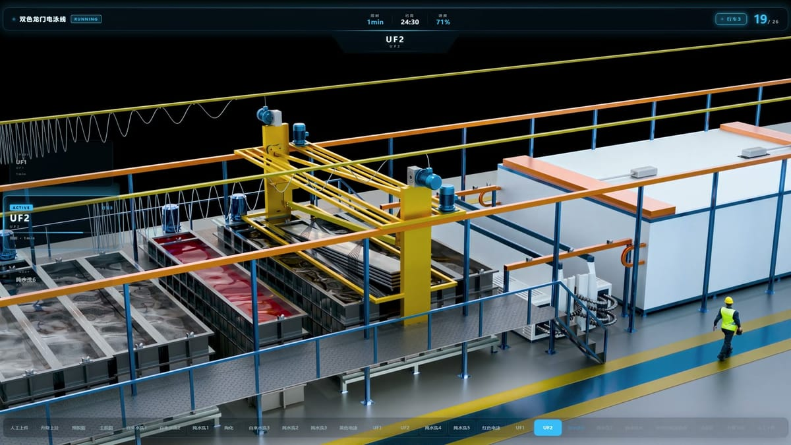
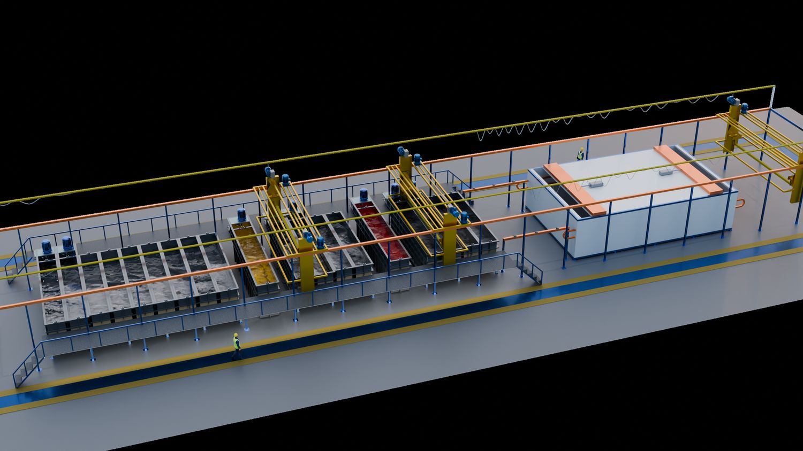
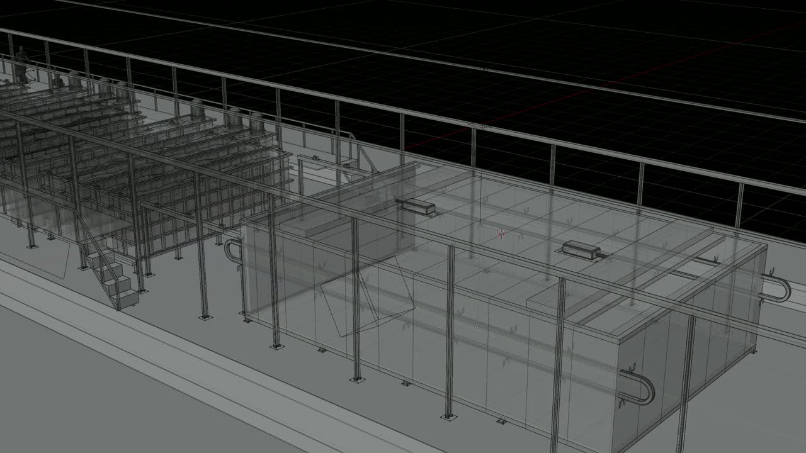
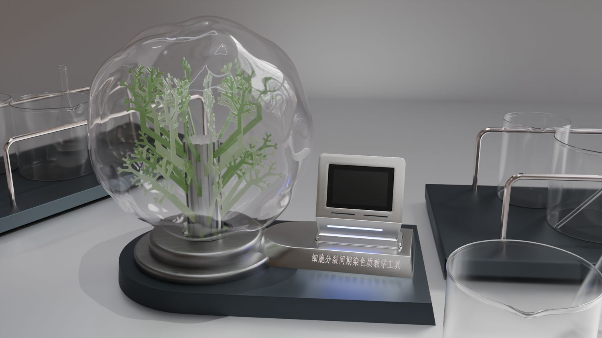
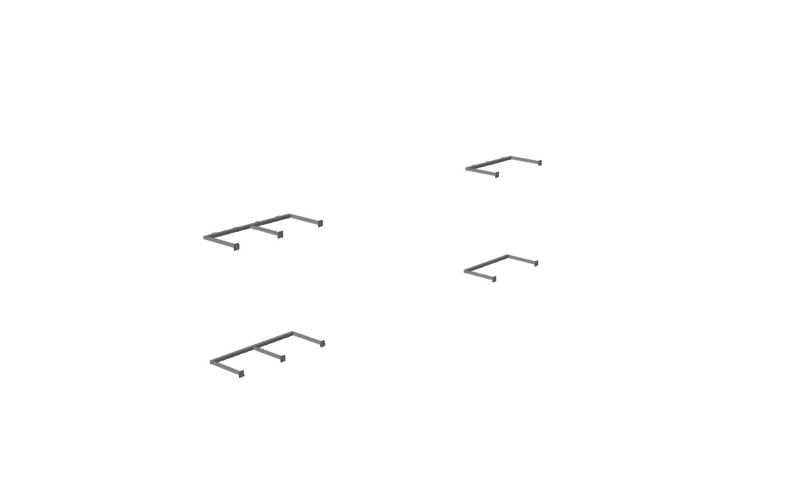

> **分类**：动画 ｜ **编号**：04-35 ｜ **完成时间**：2026-09-30
>
> **本项目含 3 部分**：产线动画正片 / 材质与静帧素材 / HUD 数据看板动效
>
> **使用工具**：Blender / Premiere Pro / After Effects / SolidWorks / Substance Painter / HTML-CSS-JS
>
> **标签**：产线动画 · 工业 · 三维动画 · 材质 · PBR · 静帧 · HUD · 数据可视化

## 说明

这是目前体量最大的一个项目，也是唯一一个拆开做了三件产出物的：**为一条双色龙门电泳线做的三维演示动画**，加上给这条线做的**材质与静帧**，以及叠在画面上报参数的 **HUD 数据看板**。

三者是一套：动画负责把工艺流程讲清楚，材质静帧决定画面里的金属与槽液看起来有没有重量，HUD 负责让观众随时知道「现在走到哪一步、温度多少」。

成片（2560×1440 / 30fps）实测 **143.43 秒、4303 帧**。另外还有一版 4000 帧（133.33 秒）的中间输出，配音的时间轴是按那一版对齐的——两版差在结尾段落，最终发布的是 143 秒这一版。

> 同一位客户还有另一条线（喷涂线），单独成篇：[喷涂线动画](/blog/works/04-36/)。

## 这条线在做什么

整条线是从右往左走的，流程按配音稿核对过一遍：

升降上挂 → 预脱脂 2 min → 主脱脂 3 min → 自来水洗 1、2 → 纯水洗 1 → 硅烷 2 min → 自来水洗 3 → 纯水洗 2、3 → **黄色电泳（路过不停留）** → UF1、2 → 纯水洗 4、5 → **红色电泳 3 min** → UF1、2 → 纯水洗 6、7 → 自动吹水（上下 2 次）→ 步进式烘道 30 min（两道移门）→ 冷却区 → 升降下挂。文档里未标时间的工序按 1 min 计。

「双色」是这条线的关键：黄、红两条电泳线共用前后的前处理与后处理段，工件路过对方电泳槽时**不下降、不停留**——这一点在画面里必须交代清楚，否则很容易看成一条线走了两遍。

> 配音稿里还标了一处术语修正：前处理这步应由「陶化」改为「硅烷」，脚本里对应替换了 3 个文件。

## 镜头怎么走的

全片是一条**连续推轨长镜头，没有剪切点**——这决定了制作方式：不能按镜头分别渲染再剪，而是把整条线的运动一次走完。按配音与画面的对应关系，大致分成六段：

| 时间 | 内容 |
| --- | --- |
| 0:00–0:13 | 上挂区俯视开场、片头标题与线体总览 |
| 0:13–0:41 | 前处理槽区推进，讲行车运行方式与工艺构成 |
| 0:41–1:14 | 前处理槽位细节 + 一号行车交接 |
| 1:14–1:43 | 电泳段，二号行车全程 |
| 1:43–2:07 | 红色电泳槽经过、三号行车前段 |
| 2:07–2:13 | 烘道到冷却区收尾 |

三台龙门行车的逻辑是各自走完末道后返回首道，一环扣一环：一号行车跑预脱脂到自来水洗 3 后回预脱脂；二号从自来水洗 3 接到纯水洗 5 后返回；三号从纯水洗 5 接红色电泳一直到冷却区。

## 配音与字幕

配音是单独做的一块：成片音轨 **33 句**，对应 33 个 30fps 标记点，另外导出 srt 字幕。素材分六类管理——试听、开头 4 段、过渡 8 段、槽位 56 段、其它 17 段，加串词总计 123.6 秒。

技术侧记录一下，方便以后复用：音色用 `zh-CN-XiaoxiaoNeural`（晓晓），语速 −5%、音调 +0Hz；输出 wav 48 kHz / 单声道 / 16 bit；生成走 Python 脚本 + Edge TTS，时间轴脚本负责把音频按帧对齐。第一轮素材之外，后面又补了一轮 66 段的说明音频，补齐线体说明、前处理原理与电泳及泳后原理，合并音轨 399.94 秒、连读 213.89 秒。

## 材质与静帧

这条产线在动画里看起来是不是金属、有没有重量，取决于这一组东西：按 PBR 规范分通道（BaseColor / Metallic / Normal / Roughness）整理的材质组，加 8 张用于核对质感与构图的静帧，用 Blender 与 Substance Painter 完成。材质按通道拆开的好处是换设备时不用重做整张图，替换对应通道即可。

## HUD 数据看板

HUD 不是画面里的三维物件，而是一层**独立渲染、透明底输出的叠加层**：直接盖在三维画面或实拍素材上，实时显示工序名称、温度、时间等参数。

- **界面本体用 HTML / CSS / JS 写**，作品文件夹里留了 11 个可编辑的 HTML 源文件，包括 `最终版ui.html`、`历史.html`、`历史 (1)–(5).html` —— 从文件名就能看出这套界面是反复改出来的
- **按工序切分输出**：整条线 26 道工序，HUD 也按这个粒度切成分段 MOV，后期按工序取用，不用整段重渲
- **动效与合成**交给 After Effects 和 Premiere Pro

## 素材情况

三部分加起来源文件 432 个 / 2231.5 MB：其中三维工程 15 个、视频/剪辑 37 个、文档 14 个（分镜、配音稿、时间轴脚本）。

⚠️ 原始 MOV 母版与 9225 张 PNG 渲染序列体积极大（合计约 56 GB），没有复制进作品集；这里放的是可直接用于网页预览的 MP4 版本。

## 动图

## 预览

## 素材

| 项目 | 数量 |
| --- | --- |
| 源文件 | 432 个 / 2231.5 MB |
| 构成 | 图片 19 个 · 三维工程 15 个 · 视频/剪辑 37 个 · 文档 14 个 · 其它 347 个 |

制作时间跨度：2026-09-01 ～ 2026-09-30

## 过程与复盘

一个月里主要做了三件事：把产线模型与运动关系在三维里跑通、把长镜头一次推完、以及配音与画面的逐帧对齐，之后又补了材质静帧与 HUD。真正花时间的不是渲染，而是「哪一步该在画面里停留多久」——配音字数、字幕断句和镜头速度必须互相迁就。

<!-- 待补：等作者口述「怎么起手、改了几版、卡在哪、最后怎么定稿」后补上 -->
