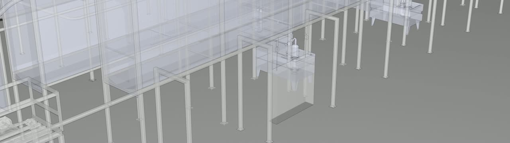
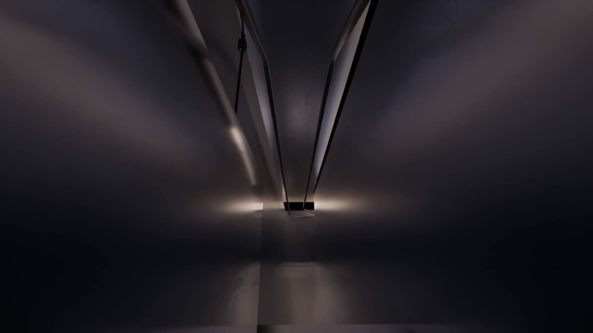
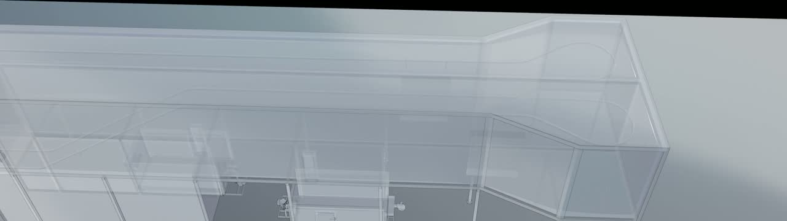

> **分类**：场景动画 ｜ **编号**：04-36 ｜ **完成时间**：2026-09-16
>
> **使用工具**：Blender / Premiere Pro
>
> **标签**：产线动画 · 工业 · 三维动画 · 场景

## 说明

另一条工业产线的三维动画：喷粉线、喷淋（淋浴）线、烘干线、总装线，以及合成后的总览长条画面。含 Blender 工程、STEP/OBJ 模型、各分段 MP4/MKV 输出与 Premiere 工程。

## 预览

## 素材

| 项目 | 数量 |
| --- | --- |
| 文件 | 75 个 / 991.1 MB |
| 图片 | 0 张 |
| 视频 | 18 段 |

制作时间跨度：2026-09-01 ～ 2026-09-16
