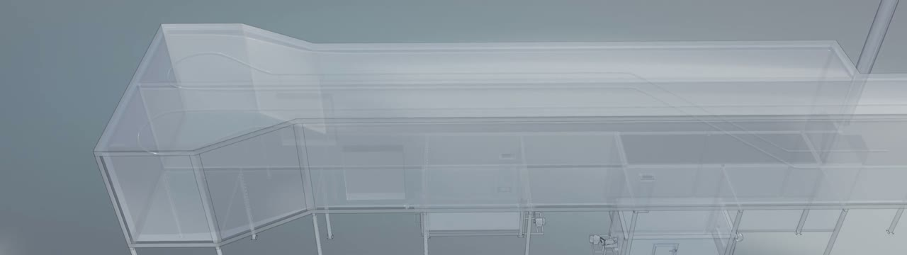
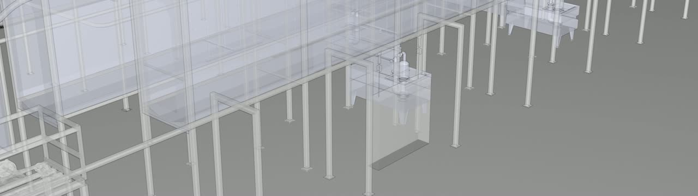

> **分类**：场景动画 ｜ **编号**：04-36 ｜ **完成时间**：2026-09-16
>
> **使用工具**：Blender / Premiere Pro
>
> **标签**：产线动画 · 工业 · 三维动画 · 场景

## 说明

一条前处理喷塑线的分段三维动画：把工件从人工上件开始，经过预脱脂、主脱脂、四级水洗、硅烷、前烘干、喷粉、后烘干固化到人工下件的全过程逐段讲清楚。四套三维工程分别对应总览线路、淋浴（前处理）线路、烘干线路与喷粉线路，分段渲染后再合成总览长条画面。

这类动画和纯产品渲染的区别在于：镜头服务的不是「好看」，而是让不懂涂装工艺的人在两分钟内看明白「这一步在做什么、为什么这么做」。所以节奏是照着工序表切的，配音字数也是按秒预留的。

## 分镜与节奏

分镜表一共 14 个镜头，配音文案按镜头预留字数（合计约 714 字），按表相加总时长 226 秒：

| 镜次 | 内容 | 时长 | 配音预留 |
| --- | --- | --- | --- |
| 01 | 片头总览 | 12s | 40 字 |
| 02 | 人工上件 | 12s | 40 字 |
| 03 | 淋浴 1 · 预脱脂 | 16s | 50 字 |
| 04 | 淋浴 2 · 主脱脂 | 18s | 55 字 |
| 05 | 淋浴 3 · 水洗 1 | 12s | 38 字 |
| 06 | 淋浴 4 · 水洗 2（逆流节水示意） | 14s | 45 字 |
| 07 | 淋浴 5 · 硅烷（常温成膜、纳米级转化膜） | 28s | 90 字 |
| 08 | 淋浴 6 · 水洗 3 | 12s | 38 字 |
| 09 | 淋浴 7 · 水洗 4 | 14s | 45 字 |
| 10 | 前烘干箱预热 | 18s | 55 字 |
| 11 | 喷粉线喷粉 | 28s | 90 字 |
| 12 | 后烘干箱固化 | 20s | 60 字 |
| 13 | 人工下件 | 12s | 38 字 |
| 14 | 片尾总结（全工序回顾 + Logo） | 10s | 30 字 |

## 配音文稿里的工艺参数

写配音的时候把工序参数核了一遍，这些数字同时也是画面节奏的依据：

- **预脱脂**：2 分钟 / 40–45 ℃
- **主脱脂**：3 分钟 / 40–45 ℃
- **水洗 1、水洗 2**：各 0.9 分钟，常温；水洗 2 的水逆流回水洗 1，水洗 1 溢流排放
- **硅烷**：1.5–2 分钟，常温。文稿里强调它无重金属、无磷、无需加温、无沉渣，中和后可直接排放
- **水洗 3、水洗 4**：各 0.9 分钟，常温；同样逆流回用（水洗 4 → 水洗 3，水洗 3 溢流排放）
- **预热烘干**：14 分钟 / 120–160 ℃
- **喷粉**：自动喷枪覆盖平面、管子与角铁，凹槽、死角与阴角靠人工补喷
- **固化烘干**：28 分钟 / 185–220 ℃，之后自然冷却 20 分钟再人工下件

逆流补水这条线是整条前处理里最值得讲的部分：两级逆流把清洗水重复利用，也是硅烷工艺相比传统磷化更环保的地方。

## 预览

## 素材

| 项目 | 数量 |
| --- | --- |
| 源文件 | 75 个 / 991.1 MB |
| 构成 | 三维工程 4 个 · 视频/剪辑 46 个 · 文档 4 个 · 其它 21 个 |

制作时间跨度：2026-09-01 ～ 2026-09-16
