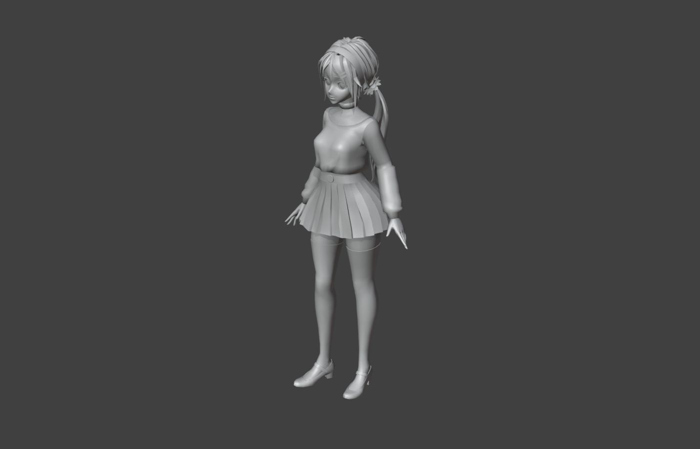
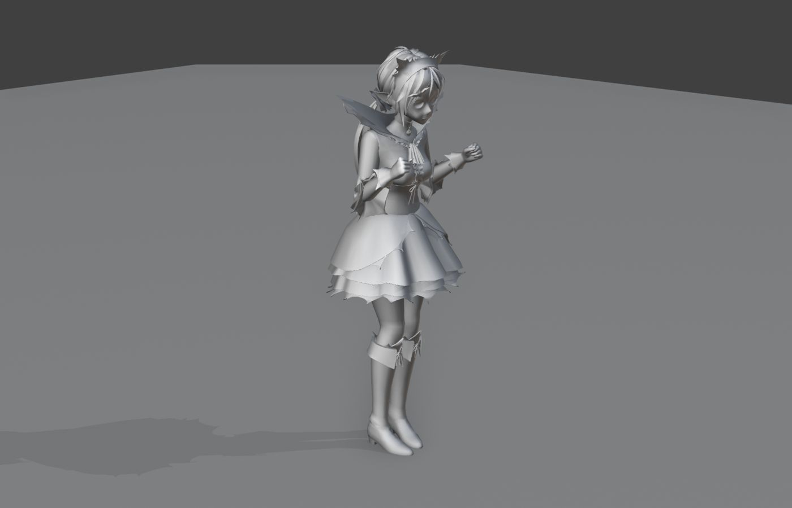

> **分类**：场景动画 ｜ **编号**：04-38 ｜ **完成时间**：2025-01-01
>
> **使用工具**：Blender / MMD
>
> **标签**：场景 · 卡通 · 动画 · 角色

## 说明

两个场景类作品：

**1) 风格化卡通场景** —— Blender 制作的卡通渲染场景工程（04_风格化卡通场景_bude.blend）。

**2)《Mita》开场动画** —— 用 MMD 模型（KindMita，含 pmx 模型与贴图）在 Blender 中制作的角色开场动画，输出为 104 MB 的 MP4。

## 预览

## 素材

| 项目 | 数量 |
| --- | --- |
| 文件 | 15 个 / 188.9 MB |
| 图片 | 18 张 |
| 视频 | 1 段 |

制作时间跨度：2024-04-07 ～ 2025-01-01
