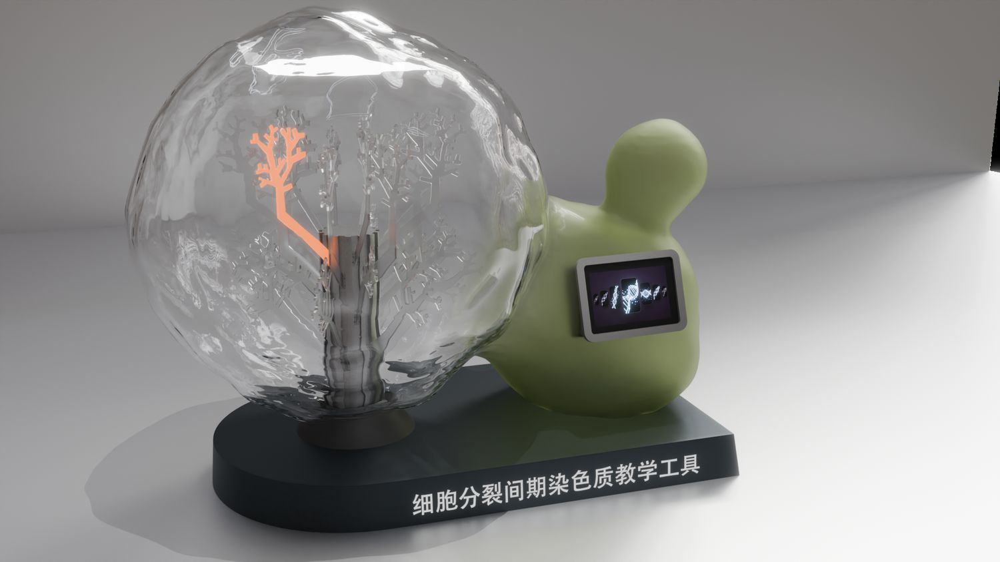
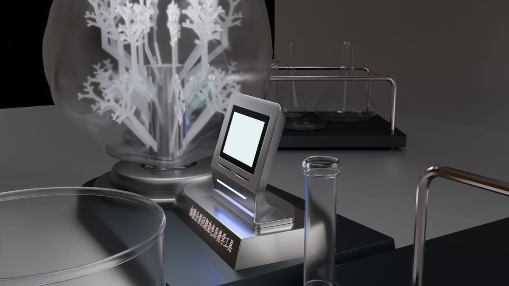
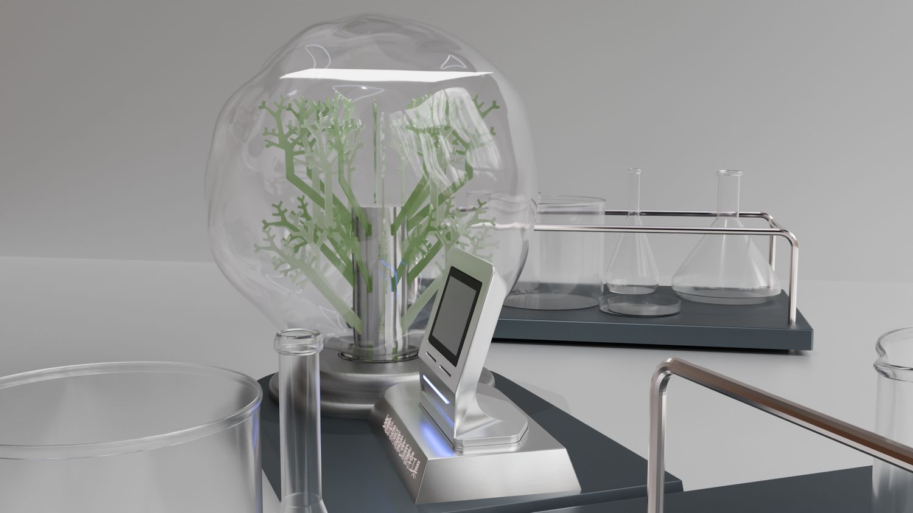

> **分类**：场景动画 ｜ **编号**：04-40 ｜ **完成时间**：2026-09-18
>
> **使用工具**：Blender
>
> **标签**：场景 · 产品 · 渲染

## 说明

桌面景观雪花球的产品场景渲染（与「三维建模 / 雪花球」同源），6 张不同角度与灯光下的场景图。

## 预览

## 素材

| 项目 | 数量 |
| --- | --- |
| 源文件 | 6 个 / 14.0 MB |
| 构成 | 图片 6 个 |

制作时间跨度：2026-09-17 ～ 2026-09-18

## 过程与复盘

<!-- 待补：这一段等程口述制作过程（怎么起手、改了几版、卡在哪、最后怎么定稿）后再写 -->
