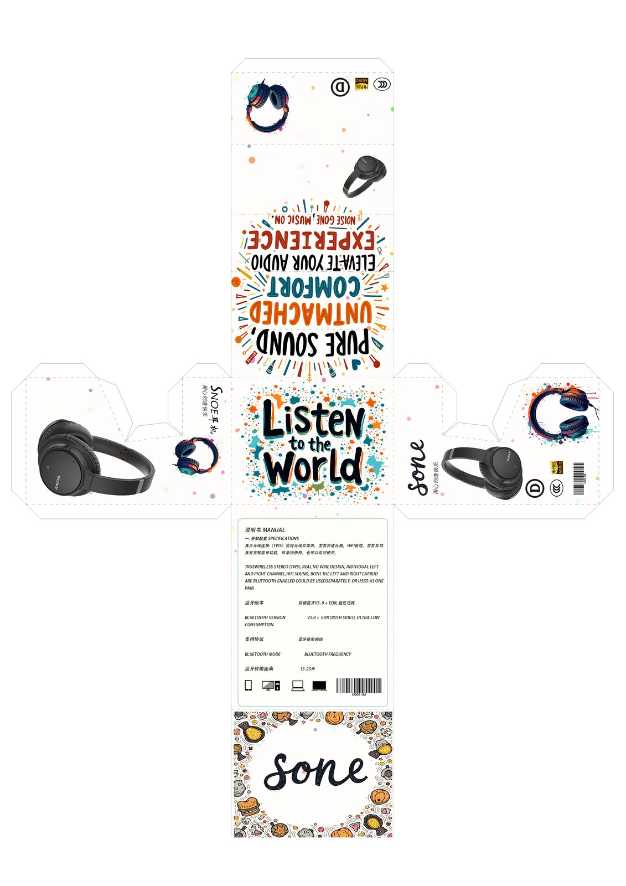
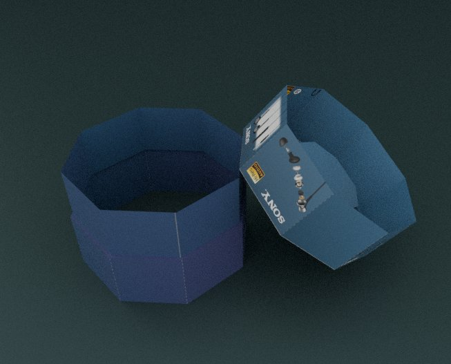
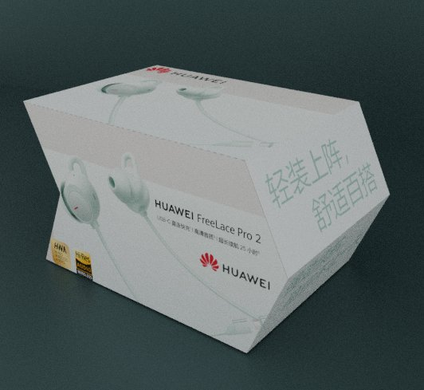
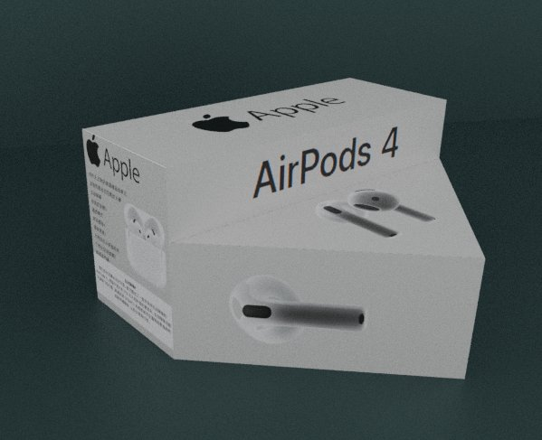
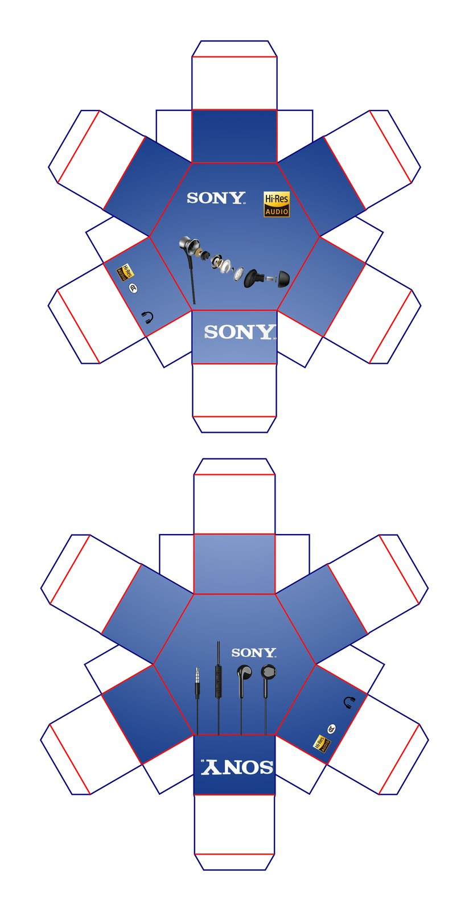

> **分类**：平面 ｜ **编号**：pack-2024 ｜ **完成时间**：2024-12-29
>
> **使用工具**：Photoshop / Illustrator
>
> **标签**：包装 · 练习 · 平面

## 说明

2024 年 12 月做的同一批包装设计练习，共 9 张：从盒型、版面到成品的推演。日期按源文件时间推断（12-17 到 12-29），不是精确的创作日。

## 预览

## 素材

| 项目 | 数量 |
| --- | --- |
| 源文件 | 0 个 / 0.0 MB |

