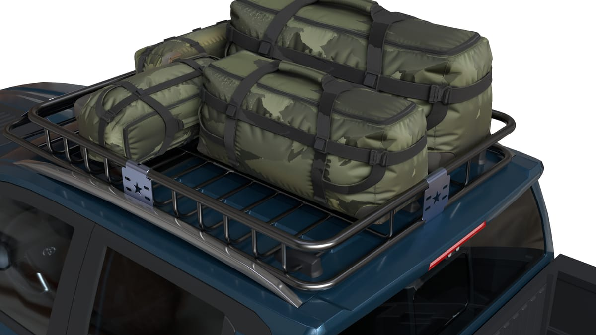
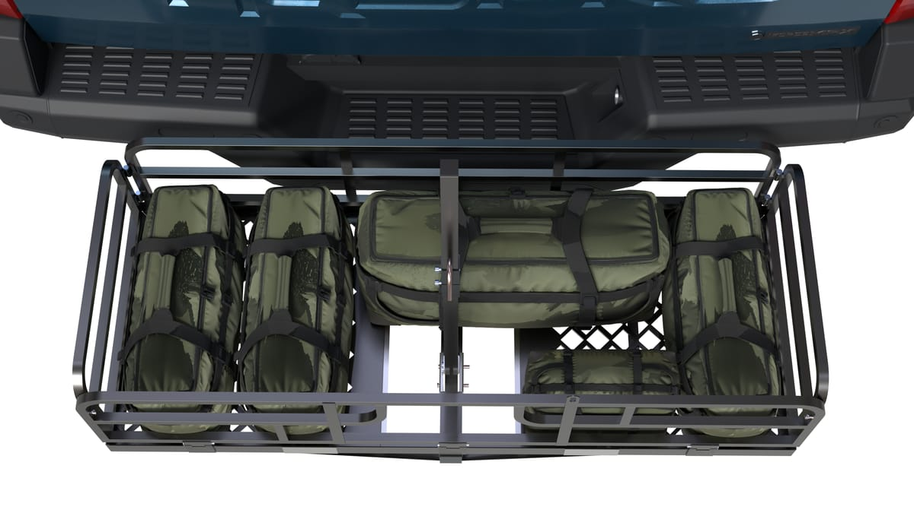
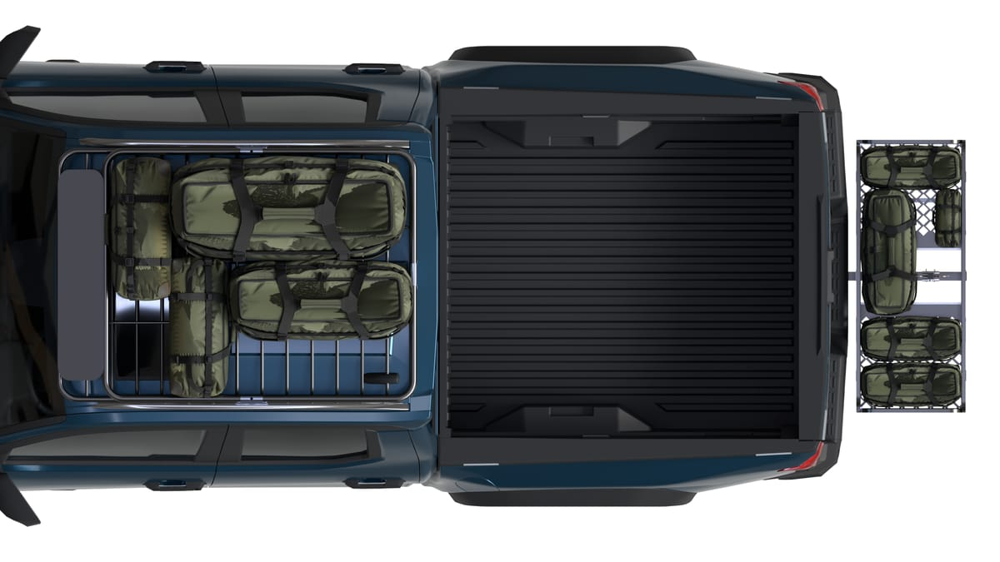
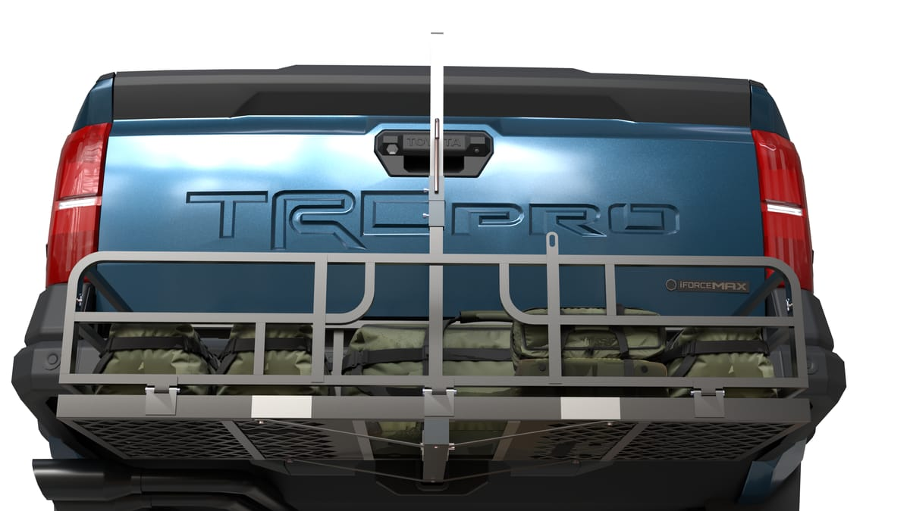
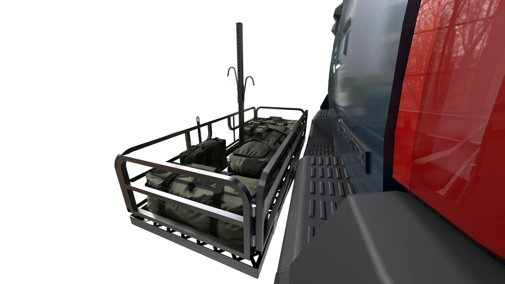
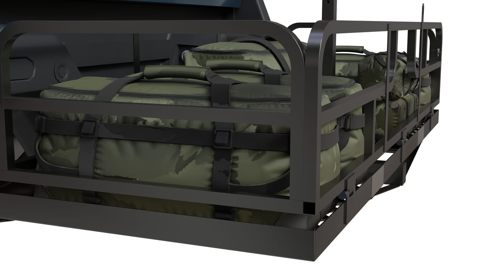
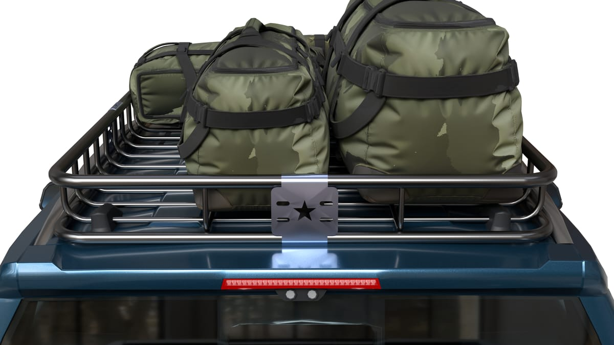
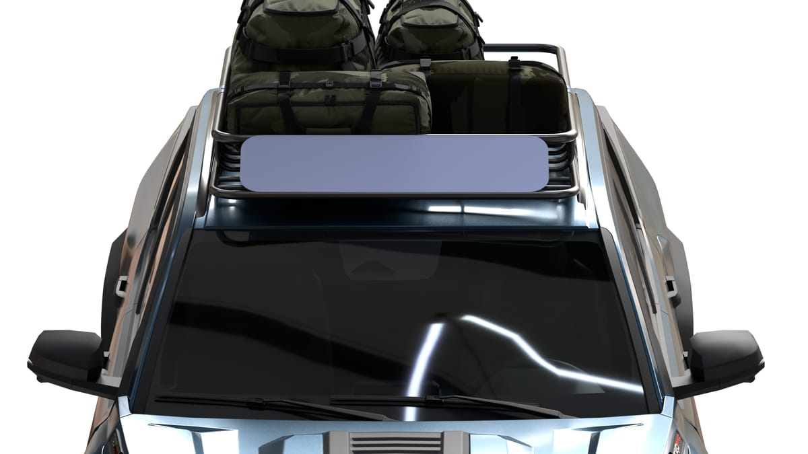
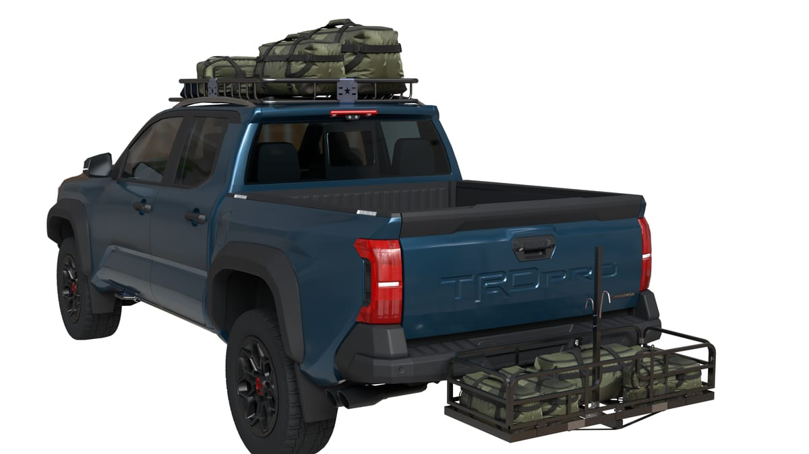

> **分类**：建模渲染 ｜ **编号**：roof-rack ｜ **完成时间**：2026-10-09
>
> **使用工具**：SolidWorks / Blender / GPT Image
>
> **标签**：露营装备 · 产品渲染 · 视觉包装

## 说明

公司露营装备产品线里的车顶架与车尾架。SolidWorks 里核对结构与装配关系，导入 Blender 后统一材质、灯光与机位，输出纯白底产品图；白底图再交给图像模型合成场景背景，作为海外站点上架的展示素材。

白底这一版保留完整的结构关系与装配细节：管件的走向与接头、侧板的冲孔、绑带与载荷的示意。它既是产品主图的底版，也是后续动画与说明书的素材起点。

## 预览

## 素材

| 项目 | 说明 |
| --- | --- |
| 结构模型 | SolidWorks 装配体（车顶架 / 车尾架 / 脚踏板） |
| 渲染工程 | Blender 场景：材质、三点光与机位 |
| 输出 | 白底产品图 10 张（2560 × 1440，即下方预览） |
| 封面 | 白底图 + 图像模型合成的沙漠公路场景 |

制作时间跨度：2026-10-07 ～ 2026-10-09

## 后续

海外站点上架的配套物料按顺序推进：产品介绍动画、安装说明书、亚马逊详情页长图。
