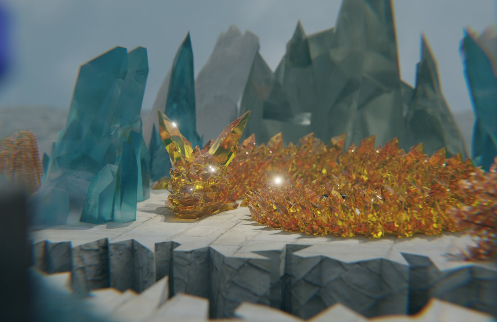
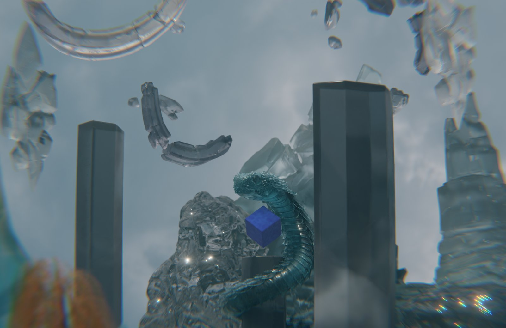

> **分类**：建模渲染 ｜ **编号**：scene-01 ｜ **完成时间**：2025-05-10
>
> **使用工具**：Blender
>
> **标签**：渲染 · 场景 · 练习

## 说明

2025 年 5 月 10 日晚上连着渲的四张，同一个幻想微缩场景换机位：左侧青蓝半透明晶柱、中间金黄晶簇、右侧深灰长方柱与灰色多面体山体，浅灰石板台地上散着透明弧形玻璃碎片。第一张是全景，另外三张分别给了金黄晶体的趴伏兽形、青蓝分节蛇形生物，以及从青蓝晶片躯体背后越肩看过去的机位。

*源文件 0 个 / 0.0 MB · 制作于 2025-05-10*

## 预览

